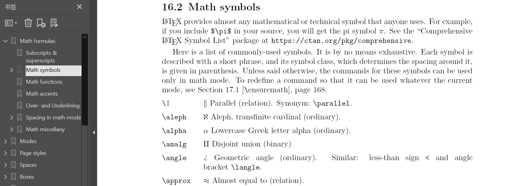
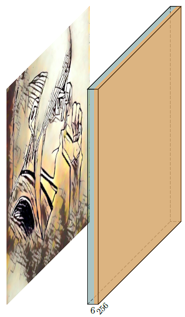
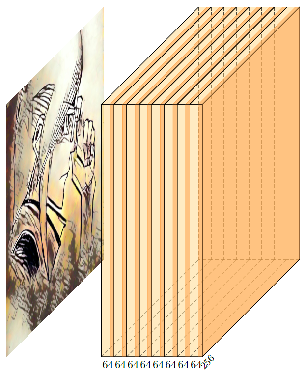
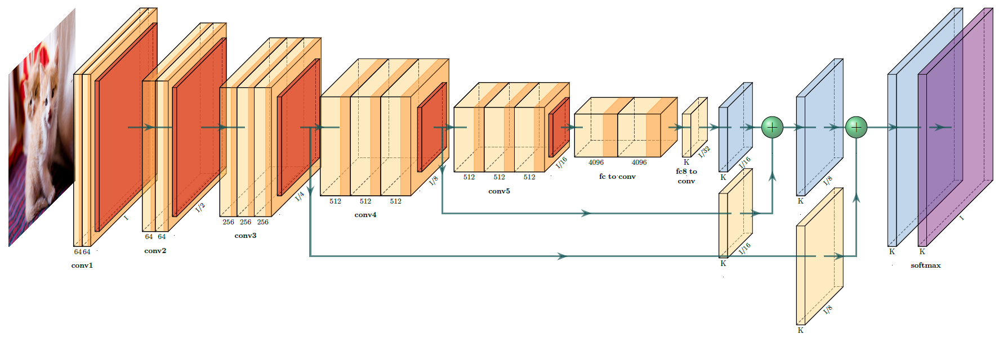
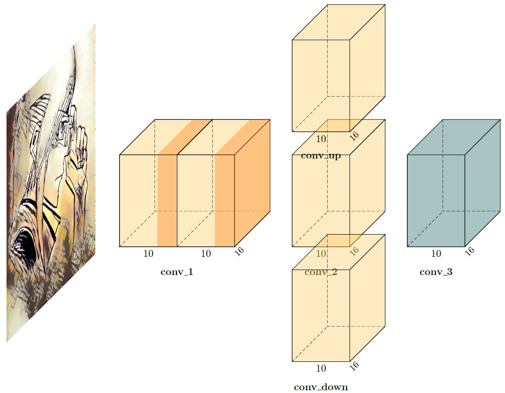
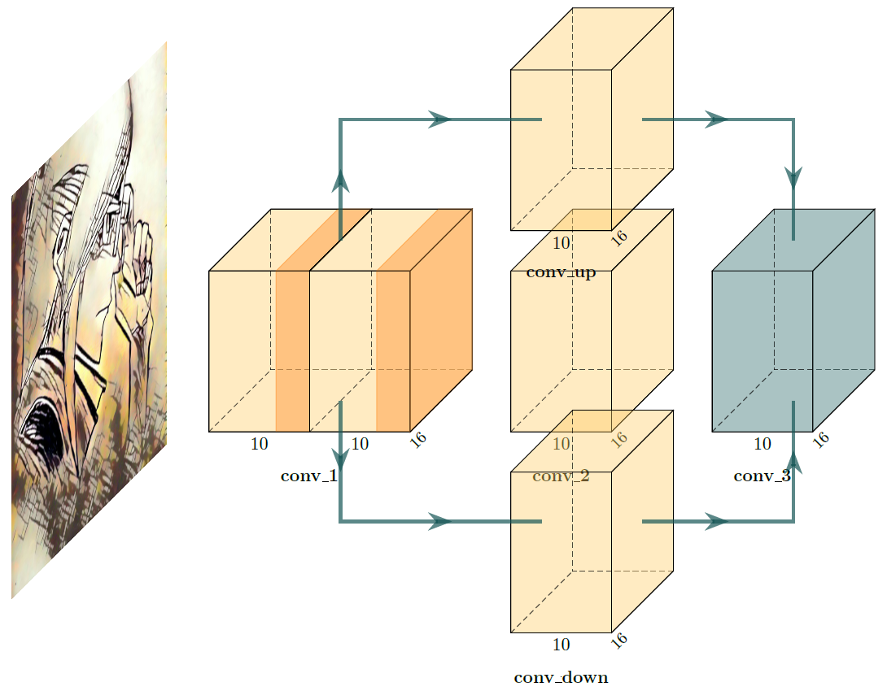
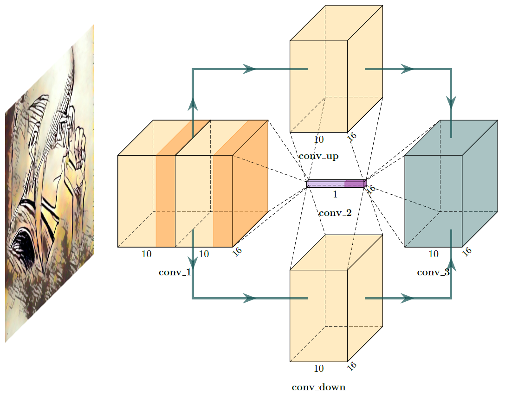

首先需要明确一点就是咱的公式哈，到[官网](https://www.latex-project.org/)走一波


进入 help


建议使用这个文档[LaTeX: Structured documents for TeX (unofficial LaTeX reference manual)](http://ctan.org/pkg/latex2e-help-texinfo)


我直接建议下载文档



然后到数学公式里找点乐子

可以查阅到，乘法公式为\\time 因此如果要画乘法算子，可以改一下原来的to\_sum()

```
def to_Mul( name, offset="(0,0,0)", to="(0,0,0)", radius=2.5, opacity=0.6):
    return r"""
\pic[shift={"""+ offset +"""}] at """+ to +""" 
    {Ball={
        name=""" + name +""",
        fill=\SumColor,
        opacity="""+ str(opacity) +""",
        radius="""+ str(radius) +""",
        logo=$\\times$
        }
    };
"""
```

然后关于其他模块，这里拿depthwiseconv举例，首先在颜色里自定义

```
\def\DepthwiseColor{rgb:blue,5;green,5;red,2}
```

然后修改原卷积函数（仅做举例）

```
def to_DWConv_Relu( name, s_filer=256, n_filer=64, offset="(0,0,0)", to="(0,0,0)", width=2, height=40, depth=40, caption=" " ):
    return r"""
\pic[shift={ """+ offset +""" }] at """+ to +""" 
    {RightBandedBox={
        name="""+ name +""",
        caption="""+ caption +""",
        xlabel={{ """+ str(n_filer) +"""}},
        zlabel="""+ str(s_filer) +""",
        fill=\DepthwiseColor,
        bandfill=\ConvReluColor,
        height="""+ str(height) +""",
        width={ """+ str(width) +""" },
        depth="""+ str(depth) +"""
        }
    };
"""
```



有关 to\_ConvConvRelu() 怎么变成 to\_ConvRelu() 就不细说了哈，这里只是拿叠了8个模块的举例哈

```
def to_Conv_8_Relu( name, s_filer=256, n_filer=(64, 64, 64, 64, 64, 64, 64, 64), offset="(0,0,0)", to="(0,0,0)", width=(2, 2, 2, 2, 2, 2, 2, 2), height=40, depth=40, caption=" " ):
    return r"""
\pic[shift={ """+ offset +""" }] at """+ to +""" 
    {RightBandedBox={
        name="""+ name +""",
        caption="""+ caption +""",
        xlabel={{ """+ str(n_filer[0]) +""", """+ str(n_filer[1]) +""" , """+ str(n_filer[2]) +""", """+ str(n_filer[3]) +""", """+ str(n_filer[4]) +""", """+ str(n_filer[5]) +""" , """+ str(n_filer[6]) +""", """+ str(n_filer[7]) +"""}},
        zlabel="""+ str(s_filer) +""",
        fill=\ConvColor,
        bandfill=\ConvReluColor,
        height="""+ str(height) +""",
        width={ """+ str(width[0]) +""" , """+ str(width[1]) +""", """+ str(width[2]) +""", """+ str(width[3]) +""", """+ str(width[4]) +""" , """+ str(width[5]) +""", """+ str(width[6]) +""", """+ str(width[7]) +""" },
        depth="""+ str(depth) +"""
        }
    };
"""
```



最后说一下连线这里，我的建议是，直接看tex文件，有点意思，先看看FCN8s的栗子



```
\draw [connection]  (p1-east)    -- node {\midarrow} (cr2-west);
\draw [connection]  (p2-east)    -- node {\midarrow} (cr3-west);
\draw [connection]  (p3-east)    -- node {\midarrow} (cr4-west);
\draw [connection]  (p4-east)    -- node {\midarrow} (cr5-west);
\draw [connection]  (p5-east)    -- node {\midarrow} (cr6_7-west);
\draw [connection]  (cr6_7-east)   -- node {\midarrow} (score32-west);
\draw [connection]  (score32-east) -- node {\midarrow} (d32-west);

\path (p4-east) -- (cr5-west) coordinate[pos=0.25] (between4_5) ;
\draw [connection]  (between4_5)    -- node {\midarrow} (score16-west-|between4_5) -- node {\midarrow} (score16-west);
\draw [connection]  (d32-east) -- node {\midarrow} (elt1-west);
\draw [connection]  (score16-east) -- node {\midarrow} (score16-east -| elt1-south) -- node {\midarrow} (elt1-south);
\draw [connection]  (elt1-east) -- node {\midarrow} (d16-west);

\path (p3-east) -- (cr4-west) coordinate[pos=0.25] (between3_4) ;
\draw [connection]  (between3_4) -- node {\midarrow} (score8-west-|between3_4) -- node {\midarrow} (score8-west);
\draw [connection]  (d16-east) -- node {\midarrow} (elt2-west);
\draw [connection]  (score8-east) -- node {\midarrow} (score8-east -| elt2-south)-- node {\midarrow} (elt2-south);
\draw [connection]  (elt2-east) -- node {\midarrow} (d8-west);
\draw [connection] (d8-east) -- node{\midarrow} (softmax-west);
```

可以看的出来，只要多加node {\\midarrow}并使用两中心点的并集，就能直角拐弯了，那么先由这个起头

```
arch = [
    to_head( '..' ),
    to_cor(),
    to_begin(),
    to_input( './output/myIcon.png'),
    to_ConvConvRelu("conv1", 16, (10,10), offset="(0,0,0)", to="(0,0,0)", height=16, depth=16, width=(10,10), caption="conv\_1"),
    to_Conv("conv2_1", 16, 10, offset="(2,0,0)", to="(conv1-east)", height=16, depth=16, width=10, caption="conv\_2"),
    to_Conv("conv2_2", 16, 10, offset="(2,4,0)", to="(conv1-east)", height=16, depth=16, width=10, caption="conv\_up"),
    to_Conv("conv2_3", 16, 10, offset="(2,-4,0)", to="(conv1-east)", height=16, depth=16, width=10, caption="conv\_down"),
    to_DepthwiseConv("conv3", 16, 10, offset="(2,0,0)", to="(conv2_1-east)", height=16, depth=16, width=10, caption="conv\_3"),
    to_end()
]
```



然后追加直角连接函数，这里直接添加了四个（注意中间并集的前后顺序会影响点的位置）

```
def to_connect_from_north( of, to):  # connection from north to west
    return r"""
\draw [connection]  ("""+of+"""-north)  -- node {\midarrow} ("""+to+"""-west -| """+of+"""-north) -- node {\midarrow} ("""+to+"""-west);
"""


def to_connect_from_south( of, to):  # connection from south to west
    return r"""
\draw [connection]  ("""+of+"""-south)  -- node {\midarrow} ("""+to+"""-west -| """+of+"""-south) -- node {\midarrow} ("""+to+"""-west);
"""


def to_connect_to_north( of, to):  # connection from east to north
    return r"""
\draw [connection]  ("""+of+"""-east)  -- node {\midarrow} ("""+of+"""-east -| """+to+"""-north) -- node {\midarrow} ("""+to+"""-north);
"""


def to_connect_to_south( of, to):   # connection from east to south
    return r"""
\draw [connection]  ("""+of+"""-east)  -- node {\midarrow} ("""+of+"""-east -| """+to+"""-south) -- node {\midarrow} ("""+to+"""-south);
"""
```

然后调用以上四个函数

```
arch = [
    to_head( '..' ),
    to_cor(),
    to_begin(),
    to_input( './output/myIcon.png'),
    to_ConvConvRelu("conv1", 16, (10,10), offset="(0,0,0)", to="(0,0,0)", height=16, depth=16, width=(10,10), caption="conv\_1"),
    to_Conv("conv2_1", 16, 10, offset="(2,0,0)", to="(conv1-east)", height=16, depth=16, width=10, caption="conv\_2"),
    to_Conv("conv2_2", 16, 10, offset="(2,4,0)", to="(conv1-east)", height=16, depth=16, width=10, caption="conv\_up"),
    to_Conv("conv2_3", 16, 10, offset="(2,-4,0)", to="(conv1-east)", height=16, depth=16, width=10, caption="conv\_down"),
    to_DepthwiseConv("conv3", 16, 10, offset="(2,0,0)", to="(conv2_1-east)", height=16, depth=16, width=10, caption="conv\_3"),
    to_connect_from_north("conv1", "conv2_2"),
    to_connect_from_south("conv1", "conv2_3"),
    to_connect_to_north("conv2_2", "conv3"),
    to_connect_to_south("conv2_3", "conv3"),
    to_end()
]
```



对于从far、near连接，我在这里就不详细说明了

最后就是点划线了，在FCN32的栗子中，我看到了这样的语句，那咱们也可以仿照嘛

```
%%%%%%%%%%%%%%%%%%%%%%%%%%%%%%%%%%%%%%%%%%%%%%%%%%%%%%%%%%%%%%%%%%%%%%%%%%%%%%%%%%%%%%%%
%% Draw Dotted Edges 
%%%%%%%%%%%%%%%%%%%%%%%%%%%%%%%%%%%%%%%%%%%%%%%%%%%%%%%%%%%%%%%%%%%%%%%%%%%%%%%%%%%%%%%%
\draw[densely dashed]
(c8-nearnortheast) -- (d32-nearnorthwest)
(c8-nearsoutheast) -- (d32-nearsouthwest)
(c8-farsoutheast)  -- (d32-farsouthwest)
(c8-farnortheast)  -- (d32-farnorthwest)
;
%%%%%%%%%%%%%%%%%%%%%%%%%%%%%%%%%%%%%%%%%%%%%%%%%%%%%%%%%%%%%%%%%%%%%%%%%%%%%%%%%%%%%%%%
```

那么首先在函数库中追加以下几个函数

```
def to_dash_from_north( of, to):
    return r"""
\draw[densely dashed]
    ("""+of+"""-nearnorthwest) -- ("""+to+"""-nearsouthwest)
    ("""+of+"""-nearnortheast) -- ("""+to+"""-nearsoutheast)
    ("""+of+"""-farnortheast) -- ("""+to+"""-farsoutheast)
    ("""+of+"""-farnorthwest) -- ("""+to+"""-farsouthwest);
"""


def to_dash_from_south( of, to):
    return r"""
\draw[densely dashed]
    ("""+of+"""-nearsouthwest) -- ("""+to+"""-nearnorthwest)
    ("""+of+"""-nearsoutheast) -- ("""+to+"""-nearnortheast)
    ("""+of+"""-farsoutheast) -- ("""+to+"""-farnortheast)
    ("""+of+"""-farsouthwest) -- ("""+to+"""-farnorthwest);
"""


def to_dash_from_west( of, to):
    return r"""
\draw[densely dashed]
    ("""+of+"""-nearsouthwest) -- ("""+to+"""-nearsoutheast)
    ("""+of+"""-nearnorthwest) -- ("""+to+"""-nearnortheast)
    ("""+of+"""-farsouthwest) -- ("""+to+"""-farsoutheast)
    ("""+of+"""-farnorthwest) -- ("""+to+"""-farnortheast);
"""


def to_dash_from_east( of, to):
    return r"""
\draw[densely dashed]
    ("""+of+"""-nearsoutheast) -- ("""+to+"""-nearsouthwest)
    ("""+of+"""-nearnortheast) -- ("""+to+"""-nearnorthwest)
    ("""+of+"""-farsoutheast) -- ("""+to+"""-farsouthwest)
    ("""+of+"""-farnortheast) -- ("""+to+"""-farnorthwest);
"""
```

然后在生成代码中调用

```
arch = [
    to_head( '..' ),
    to_cor(),
    to_begin(),

    to_input( './output/myIcon.png'),

    to_ConvConvRelu("conv1", 16, (10,10), offset="(0,0,0)", to="(0,0,0)", height=16, depth=16, width=(10,10), caption="conv\_1"),

    to_fcRelu("conv2_1", 16, 10, offset="(2,0,0)", to="(conv1-east)", height=1, depth=1, width=10, caption="conv\_2"),
    to_Conv("conv2_2", 16, 10, offset="(2,4,0)", to="(conv1-east)", height=16, depth=16, width=10, caption="conv\_up"),
    to_Conv("conv2_3", 16, 10, offset="(2,-4,0)", to="(conv1-east)", height=16, depth=16, width=10, caption="conv\_down"),

    to_DepthwiseConv("conv3", 16, 10, offset="(2,0,0)", to="(conv2_1-east)", height=16, depth=16, width=10, caption="conv\_3"),

    # connect
    to_connect_from_north("conv1", "conv2_2"),
    to_connect_from_south("conv1", "conv2_3"),
    to_connect_to_north("conv2_2", "conv3"),
    to_connect_to_south("conv2_3", "conv3"),

    # dash
    to_dash_from_north("conv2_1", "conv2_2"),
    to_dash_from_south("conv2_1", "conv2_3"),
    to_dash_from_west("conv2_1", "conv1"),
    to_dash_from_east("conv2_1", "conv3"),

    to_end()
]
```



注：这里to\_fcRelu()纯属是为了让图片看起来不那么单调换写的，函数如下

```
def to_fcRelu( name, s_filer=256, n_filer=64, offset="(0,0,0)", to="(0,0,0)", width=2, height=40, depth=40, caption=" " ):
    return r"""
\pic[shift={ """+ offset +""" }] at """+ to +""" 
    {RightBandedBox={
        name="""+ name +""",
        caption="""+ caption +""",
        xlabel={{ """+ str(n_filer) +"""}},
        zlabel="""+ str(s_filer) +""",
        fill=\FcColor,
        bandfill=\FcReluColor,
        height="""+ str(height) +""",
        width={ """+ str(width) +"""  },
        depth="""+ str(depth) +"""
        }
    };
"""
```

那么就先写这些，如果还有没说到的，应该也可以通过查阅对应tex文件完成了。
