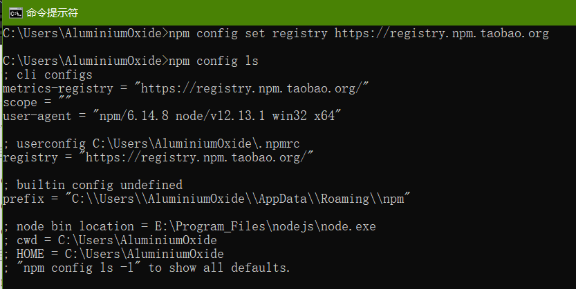
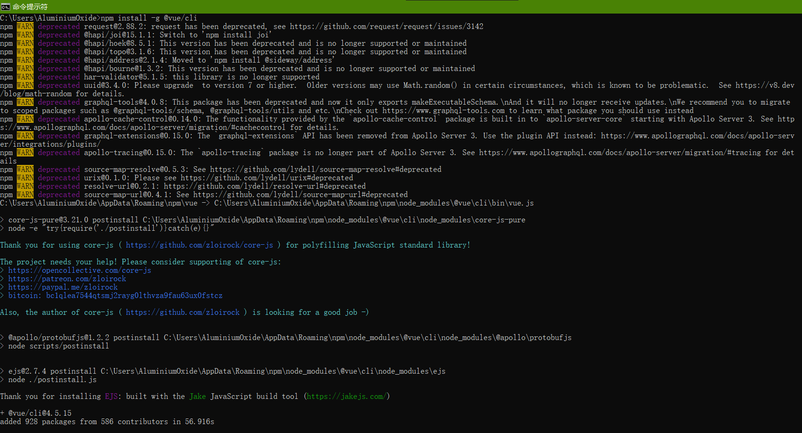
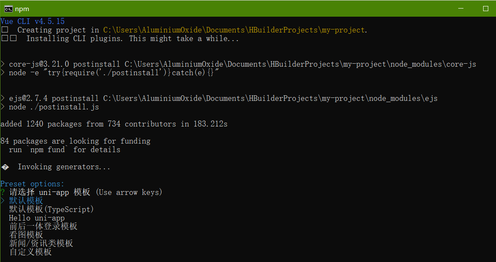
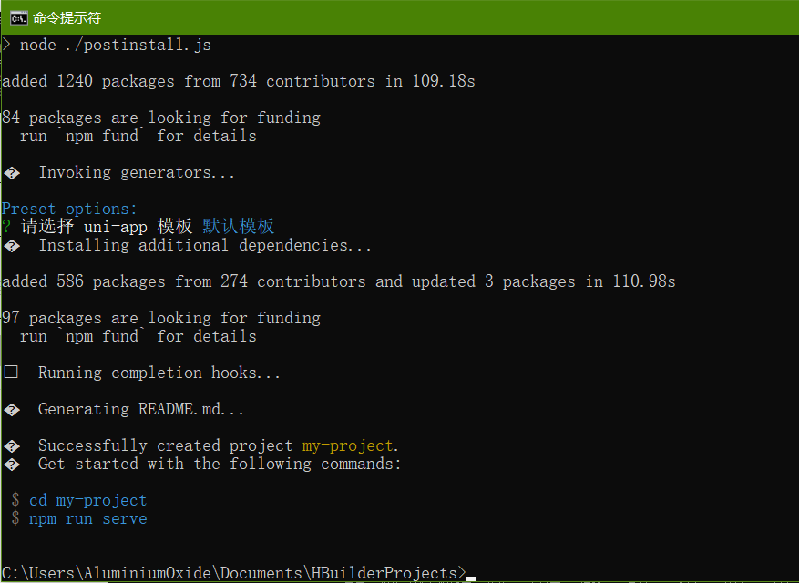
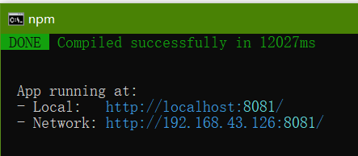
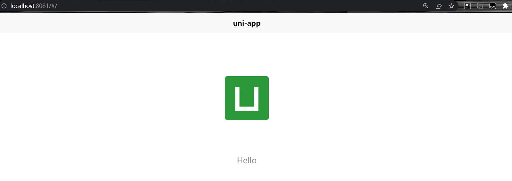

uniapp操作规范

页面文件遵循vue单文件规范

template

script

style

组件标签靠近小程序规范

JS靠近小程序规范

数据绑定使用vue.js规范

使用[Hbuilder](https://www.dcloud.io/hbuilderx.html) 开发板（略）

或者使用[官网](https://uniapp.dcloud.io/quickstart-cli)推荐的 vue-cli

```
# 打开cmd 检查node环境，没安装node.js建议先去安装
node -v  
npm -v
# 然后建议先来镜像
npm config ls
npm config set registry https://registry.npm.taobao.org/   # 设置淘宝源
npm config set registry http://www.npmjs.org               # 官方源
# 然后再安装
npm install -g @vue/cli
vue -V
```





然后根据官网的操作（这里还是建议cd到一个安全的文件夹下再创建工程吧，至少先cd document）

```
# 然后创建项目 建议先改回来，淘宝源有问题（会报433）
npm config set registry http://registry.npmjs.org/
vue create -p dcloudio/uni-preset-vue my-project
```



然后选择默认模板



根据提示执行cd和npm run命令





ctrl+c 确认后关闭
