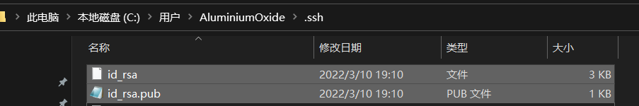
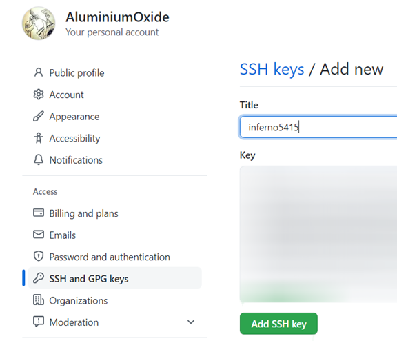
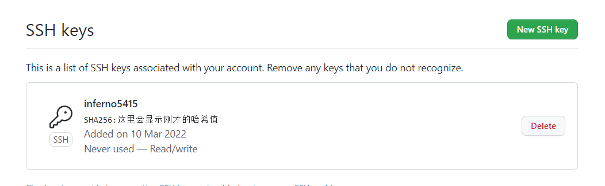
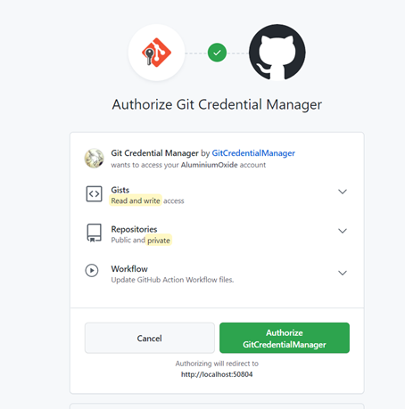
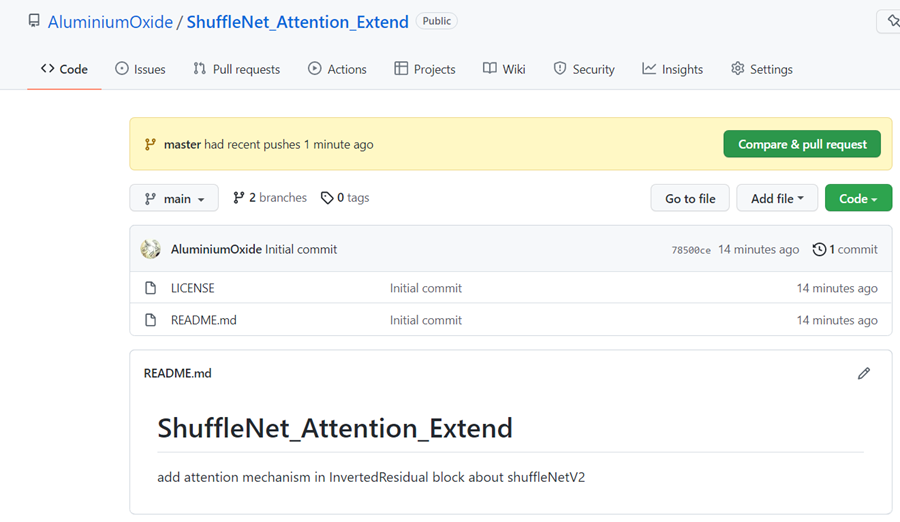
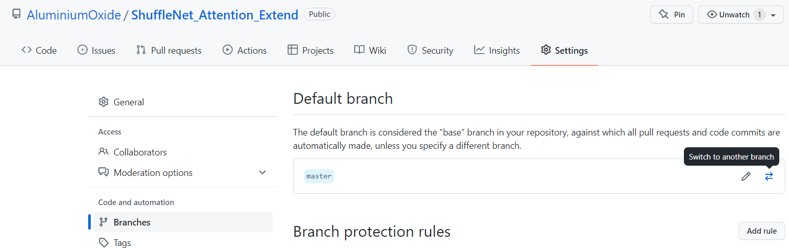

首先git init初始化仓库

```
AluminiumOxide@AluminiumOxide MINGW64 ~/Documents/GitHub/ShuffleNet_Attention_Extend (master)
$ git init
Initialized empty Git repository in C:/Users/AluminiumOxide/Documents/GitHub/ShuffleNet_Attention_Extend/.git/
```

然后git status查看状态

```
AluminiumOxide@AluminiumOxide MINGW64 ~/Documents/GitHub/ShuffleNet_Attention_Extend (master)
$ git status
On branch master

No commits yet

Untracked files:
  (use "git add <file>..." to include in what will be committed)
        data/
        draw_plot/
        proto_1_vggnet/
        proto_2_googlenet/
        proto_3_resnet/
        proto_4_densenet/
        proto_5_mobilenet/
        remix_1_shufflenet/
        shuffle_SE/
        shuffle_SK/

nothing added to commit but untracked files present (use "git add" to track)
```

然后git add . 将所有文件准备提交 (之后git status可以看到commits的文件)

```
AluminiumOxide@AluminiumOxide MINGW64 ~/Documents/GitHub/ShuffleNet_Attention_Extend (master)
$ git add .

AluminiumOxide@AluminiumOxide MINGW64 ~/Documents/GitHub/ShuffleNet_Attention_Extend (master)
$ git status
On branch master

No commits yet

Changes to be committed:
  (use "git rm --cached <file>..." to unstage)
        new file:   data/cancer_data/train/CA/CancerLib1_06_seg_1.png
        new file:   data/cancer_data/train/CA/CancerLib1_06_seg_2.png
        new file:   data/cancer_data/train/CA/CancerLib1_06_seg_4.png
        new file:   data/cancer_data/train/CA/CancerLib1_06_seg_5.png

```

然后 git commit -m "commit info you need" 随后 git status 可以查看commit里面没有任务了  
当然，没必要添加这么多字符

```
AluminiumOxide@AluminiumOxide MINGW64 ~/Documents/GitHub/ShuffleNet_Attention_Extend (master)
$ git commit -m "Add SE and SK attention in InvertedResidual block about shuffleNetV2"
[master (root-commit) cae532b] Add SE and SK attention in InvertedResidual block about shuffleNetV2
 208 files changed, 7463 insertions(+)
 create mode 100644 data/cancer_data/train/CA/CancerLib1_06_seg_1.png
 create mode 100644 data/cancer_data/train/CA/CancerLib1_06_seg_2.png
 create mode 100644 data/cancer_data/train/CA/CancerLib1_06_seg_4.png
 create mode 100644 data/cancer_data/train/CA/CancerLib1_06_seg_5.png
 create mode 100644 data/cancer_data/train/CA/CancerLib1_06_seg_6.png

AluminiumOxide@AluminiumOxide MINGW64 ~/Documents/GitHub/ShuffleNet_Attention_Extend (master)
$ git status
On branch master
nothing to commit, working tree clean
```

然后登录github，创建新的仓库


然后一路使用本地使用 ssh-keygen -t rsa -C "you email address" 产生本地的 ssh key 后面一路默认就好，就像下面

```
AluminiumOxide@AluminiumOxide MINGW64 ~/Documents/GitHub/ShuffleNet_Attention_Extend (master)
$ ssh-keygen -t rsa -C "Inferno5415@outlook.com"
Generating public/private rsa key pair.
Enter file in which to save the key (/c/Users/AluminiumOxide/.ssh/id_rsa):
Enter passphrase (empty for no passphrase):
Enter same passphrase again:
Your identification has been saved in /c/Users/AluminiumOxide/.ssh/id_rsa
Your public key has been saved in /c/Users/AluminiumOxide/.ssh/id_rsa.pub
The key fingerprint is:
SHA256:这里会显示生成的256位哈希值 Inferno5415@outlook.com
The key's randomart image is:
+---[RSA 3072]----+
|这里也会生成对应key|
+----[SHA256]-----+
```

如果不出意外，会在用户目录下的.ssh目录下生成这两个文件



然后在github上创建新的SSH KEY 点击 settings >SSH and GPG keys > new SSH keys >把刚才生成的 id\_rsa.pub (就是所谓的公钥) 用记事本打开全放到Key里(Title随意写就行) 最后add SSH Key完成



如果成功的话，



然后就是用 git remote add origin <刚才在github上的仓库地址> 和 git push -u origin master 将master分支 推送到仓库上

```
AluminiumOxide@AluminiumOxide MINGW64 ~/Documents/GitHub/ShuffleNet_Attention_Extend (master)
$ git remote add origin https://github.com/AluminiumOxide/ShuffleNet_Attention_Extend.git

AluminiumOxide@AluminiumOxide MINGW64 ~/Documents/GitHub/ShuffleNet_Attention_Extend (master)
$ git push -u origin master
Enumerating objects: 235, done.
Counting objects: 100% (235/235), done.
Delta compression using up to 8 threads
Compressing objects: 100% (224/224), done.
Writing objects: 100% (235/235), 86.97 MiB | 4.46 MiB/s, done.
Total 235 (delta 23), reused 0 (delta 0), pack-reused 0
remote: Resolving deltas: 100% (23/23), done.
remote:
remote: Create a pull request for 'master' on GitHub by visiting:
remote:      https://github.com/AluminiumOxide/ShuffleNet_Attention_Extend/pull/new/master
remote:
To https://github.com/AluminiumOxide/ShuffleNet_Attention_Extend.git
 * [new branch]      master -> master
Branch 'master' set up to track remote branch 'master' from 'origin'.
```

不出意外的话会提示授权



然后在github上就能看到推送的信息了，点击左上的main切换分支能看到master分支已经推上去了



然后记得去仓库设置里更改默认分支(从main改到master)


