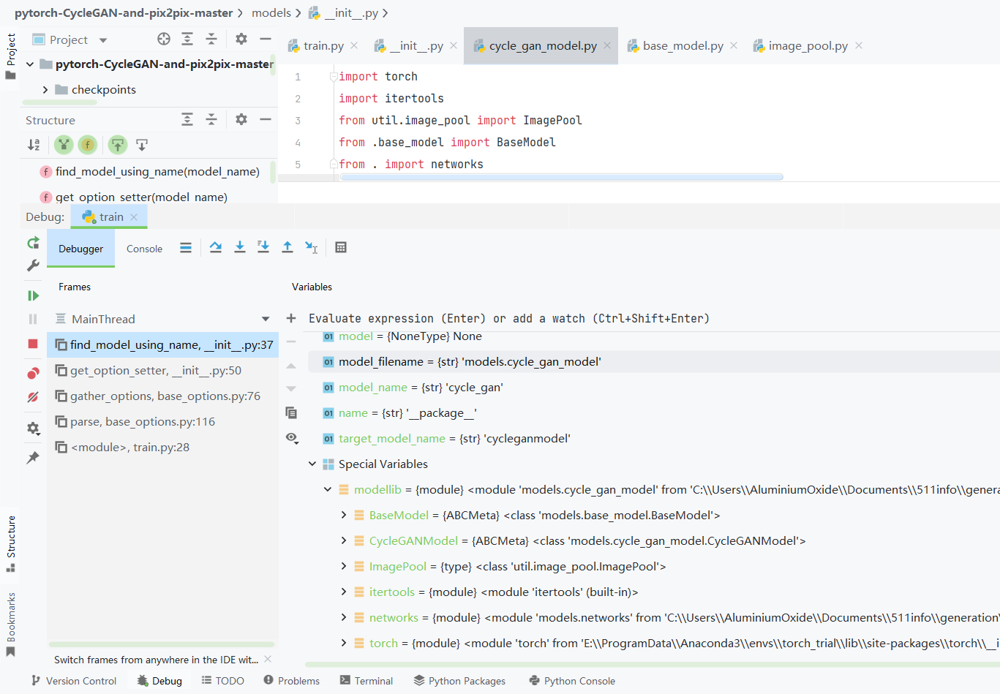
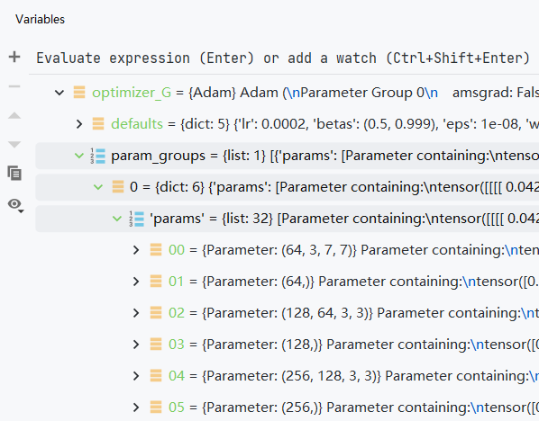

众所周知，当把训练die码调好了之后，我们来看看这个代码构成

- opt = TrainOptions().parse() 继承baseoption并执行parse()方法
    - BaseOptions的init()
    - BaseOptions的parse()
        - 在parse()里执行BaseOptions()的gather\_options()方法, 这玩意大概意思是把base,train,model,data的参数(add\_argument)都整合到一块
            - TrainOption的initialize()方法
                - BaseOption的initialize()方法,添加base的parser.add\_argument
                - 添加train的parser.add\_argument
            - models.get\_option\_setter() 用来追加和model有关的parser.add\_argument
                - find\_model\_using\_name() 寻找这个模型有没有定义
                    - 本来这个函数也挺正常的,但是调试的时候importlib.import\_module(model\_filename),心里直接羊驼飞过!

说下modellib = importlib.import\_module(model\_filename)

这个憨憨直接遍历model\_filename模型文件里面所有用到的类!!!

然后把所有遍历到的模型名称输出到一个特殊变量 modellib 里

这也导致这个憨憨在使用的时候函数堆栈指针对塞进去一坨奇怪的东西,而且这玩意是在遍历项目的目录,导致step into my code在疯狂的跳新宝岛!!!

- opt = TrainOptions().parse()
    - BaseOptions.parse()
        - **BaseOptions.gather\_options()**
            - get\_option\_setter()
                - find\_model\_using\_name()
                    - 说完modellib = importlib.import\_module(model\_filename)咱们继续
                    - 寻找modellib里的模型名和target\_model\_name相等,并且是BaseModel子类的模型
                    - 把这个模型给个叫model的变量并返回
                - 返回刚才找到模型的.modify\_commandline\_options方法 命名为 model\_option\_setter
            - 执行刚才好不容易返回的model\_option\_setter ,添加model的parser.add\_argument
            - get\_option\_setter() 和模型的套路基本一致,只不过这次实在数据集的类里找
                - find\_dataset\_using\_name()
                    - 找到数据集的类
            - dataset\_option\_setter,添加dataset的parser.add\_argument
        - **返回一块包含所有参数的命名空间给opt**
    - 打印并再设置一些GPU的参数返回

- dataset = create\_dataset(opt) 创建数据集
    - CustomDatasetDataLoader() 喜闻乐见的dataloader
        - **find\_dataset\_using\_name() ?!老兄你不对劲啊!!!**
        - 返回 dataset\_class 并实例化这个类 # 好的,dataset已经成为你的对象了,现在你可以对她......
            - make\_dataset() 这玩意返回对应目录下所有图片的路径,并组成一个list
            - get\_transform() 关于图像的预处理,只不过这里封到函数里了
            - 除了\_\_init\_\_(),下面的\_\_getitem\_\_()也建议看看,那里说的是后面取图象是怎么取的
        - 并设置dataloader
    - 用load\_data()方法,把CustomDatasetDataLoader()传出去

- model = create\_model(opt) 创建模型 类似数据集
    
    - **find\_model\_using\_name() 我就喜欢你这种让我跳过的**
    - 实例化这个类 # 好的instance也变成对象了,现在.......
        - 先BaseModel.**init**()
        - 设置8个 loss\_names
        - 设置8个 visual\_names
        - 设置4个 model\_names
        - **self.netG\_A** = **networks.define\_G()** 定义netG 的模型
            
            - get\_norm\_layer() 设置norm\_layer
            
            - 根据设置,选择 ResnetGenerator()
                - 网络定义和forward基本都在这,对于现在只有一个res的样子可以[参考这里](http://aluminium/allophane.com/index.php/2022/03/26/cyclegan_model_backup/)
            - 然后执行init\_net()
                - 设置GPU并使用init\_weights()初始化参数
        - **self.netG\_B** = networks.define\_G() 同上
        - **self.netD\_A** \= **networks.define\_D()** 定义netD 的模型
            - get\_norm\_layer() 设置norm\_layer
            - 根据设置,选择 NLayerDiscriminator()
                - 网络定义和forward基本都在这,对于现在只有一个res的样子可以[参考这里](http://aluminium/allophane.com/index.php/2022/03/26/cyclegan_model_backup/)
            - init\_net()同上
        - **self.netD\_B** = networks.define\_D() 同上
        - **ImagePool()** 很奇怪的东西 创建图像缓冲区以存储先前生成的图像
            - 这个缓冲区储存由netG生成的图像 并可以用历史来更新鉴别器netD, 而不是由生成器netG直接生成
            - 注意里面还有个query()方法
        - \# 3个损失函数
        - **criterionGAN** = GANLoss() 根据设置选择的,并带一个判断是真值real还是生成值fake,分别计算
        - **criterionCycle** = L1Loss()
        - **criterionIdt** = L1Loss()
        - \# 2个优化器
        - **optimizer\_G** Adam() 使用chain把 netG\_A 和 netG\_B 的参数 混在一起 建议结合[这里](http://aluminium/allophane.com/index.php/2022/03/26/cyclegan_model_backup/)观看调试器里的变量
        - **optimizer\_D** Adam() 同上, 不过是netD\_A 和 netD\_B
        - 然后分别把这俩优化器都放到optimizer里
    
    - 打印相关信息直接返回

- model.setup(opt) 加载和打印网络,并设置学习率衰减策略schedule
    - networks.get\_scheduler(optimizer,opt)
    - print\_networks() 字面意思
- visualizer = Visualizer(opt) 调用visdom和创建页面数据,之前没开server的这里就该出问题了
    - 里面在创建文件夹和log文件

- visualizer.reset() 字面意思 让self.saved = False 下次能更新

- for i, data in enumerate(dataset) 会执行dataset的\_\_iter\_\_()
    - 这个data给出4\*batchsize的数组
        - A A图数组
        - B B图数组
        - A\_path A图对应路径
        - B\_path B图对应路径

- model.set\_input(data) 设置哪面往哪面走
    - real\_A
    - real\_B
    - image\_paths 对应网络输入图片的路径

- **model.optimize\_parameters()** 计算损失函数，获取梯度，更新网络权重
    
    - **_\# 首先是生成器的_**
    
    - self.forward() 没啥好说的
        - self.fake\_B = self.netG\_A(self.real\_A) # G\_A(A) → B
        - self.rec\_A = self.netG\_B(self.fake\_B) # G\_B(G\_A(A)) → A
        - self.fake\_A = self.netG\_B(self.real\_B) # G\_B(B) → A
        - self.rec\_B = self.netG\_A(self.fake\_A) # G\_A(G\_B(B)) → B
    - self.set\_requires\_grad(\[self.netD\_A, self.netD\_B\], False) 冻结两个netD的梯度
    - self.optimizer\_G.zero\_grad() netG的梯度清零
    - self.backward\_G() 反传计算loss
        - 这里先计算了一下  
            self.idt\_A = self.netG\_A(self.real\_B) # G\_A(B) → B  
            self.idt\_A = self.netG\_A(self.real\_B) # G\_B(A) → A
        - loss\_idt\_A 是鉴别器A的测试损失 ||G\_A(B) - B||
        - loss\_idt\_B 是鉴别器B的测试损失 ||G\_B(A) - A||
        - loss\_G\_A 使用criterionGAN() 把 D\_A(G\_A(A)) 和opt扔进去, 生成的(1,1,30,30)和全1的(1,1,30,30)求MSEloss
        - loss\_G\_B 使用criterionGAN() 把 D\_B(G\_B(B)) 和opt扔进去, 生成的(1,1,30,30)和全1的(1,1,30,30)求MSEloss
        - loss\_cycle\_A 使用criterionCycle 说白了就是使用L1loss,即 || G\_B(G\_A(A)) - A||
        - loss\_cycle\_B 使用criterionCycle 说白了就是使用L1loss,即 || G\_A(G\_B(B)) - B||
        - loss\_G = 上面六个loss求和,然后反向传播
    
    - self.optimizer\_G.step() 更新两个G的权重
    - **_\# 然后是鉴别器的_**
    - self.set\_requires\_grad(\[self.netD\_A, self.netD\_B\], True) 解冻两个netD的梯度
    - self.optimizer\_D.zero\_grad() netD的梯度清零
    - self.backward\_D\_A()
        
        - fake\_B\_pool.query(fake\_B)取刚才G\_A(B) → B的生成图像
        
        - 设置 netD real fake 调用backward\_D\_basic(D\_A, realB, fakeB)
            - netD(real) 产生 (1,1,30,30)的输出
            - loss\_D\_real 输出和(1,1,30,30)的全1求MSEloss
            - netD(fake) 产生 (1,1,30,30)的输出
            - loss\_D\_fake 输出和(1,1,30,30)的全0求MSEloss
            - loss\_D = (loss\_D\_real + loss\_D\_fake) \* 0.5 然后反向传播
    
    - self.backward\_D\_B()
        - fake\_A\_pool.query(fake\_A)取刚才G\_B(A) → A的生成图像
        - 设置 netD real fake 调用backward\_D\_basic(D\_B, realA, fakeA)
            - netD(real) 产生 (1,1,30,30)的输出
            - loss\_D\_real 输出和(1,1,30,30)的全1求MSEloss
            - netD(fake) 产生 (1,1,30,30)的输出
            - loss\_D\_fake 输出和(1,1,30,30)的全0求MSEloss
            - loss\_D = (loss\_D\_real + loss\_D\_fake) \* 0.5 然后反向传播
    - self.optimizer\_D.step() 更新两个D的权重,和G不同的一点是,DA和DB的loss大小是不一样的

**\# 后面这些,都是次要的**

- \# display images on visdom and save images to a HTML file
    - visualizer.display\_current\_results()
- \# print training losses and save logging information to the disk
- \# cache our latest model every iterations
- \# cache our model every epochs
- model.update\_learning\_rate() # 在每个epoch后根据学习率衰减策略更新学习率.

然后说一些前面可能描述不是特别详细的,PS:记住一点,D的目的是能区分出来这是生成的,G的目的是让生成的假图片和真的差不多,让D看不出来

<table><tbody><tr><td>name</td><td class="has-text-align-center" data-align="center">AB</td><td>discrimination</td></tr><tr><td>fake_B</td><td class="has-text-align-center" data-align="center">→</td><td>G_A(A) =&gt; B</td></tr><tr><td>rec_A</td><td class="has-text-align-center" data-align="center">→ ←</td><td>G_B(G_A(A)) =&gt; A</td></tr><tr><td>fake_A</td><td class="has-text-align-center" data-align="center">←</td><td>G_B(B) =&gt; A</td></tr><tr><td>rec_B</td><td class="has-text-align-center" data-align="center">← →</td><td>G_A(G_B(B))=&gt; B</td></tr><tr><td>idt_A</td><td class="has-text-align-center" data-align="center">↳</td><td>G_A(B) =&gt; B</td></tr><tr><td>idt_B</td><td class="has-text-align-center" data-align="center">↲</td><td>G_B(A) =&gt; A</td></tr></tbody></table>

网络中生成图像的描述

<table><tbody><tr><td>D</td><td>real</td><td>fake</td></tr><tr><td>D_B</td><td>real_A</td><td>fake_A</td></tr><tr><td>D_A</td><td>real_B</td><td>fake_B</td></tr></tbody></table>

有关backward\_D\_basic的两次计算

其中real\_A和real\_B是数据集里作为输入的图像

<table><tbody><tr><td>discrimination</td><td>ideal</td></tr><tr><td>D(real)=&gt;(batchsize,1,30,30)</td><td>ones(batchsize,1,30,30)</td></tr><tr><td>D(fake)=&gt;(batchsize,1,30,30)</td><td>zeros(batchsize,1,30,30)</td></tr></tbody></table>
