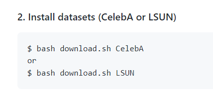
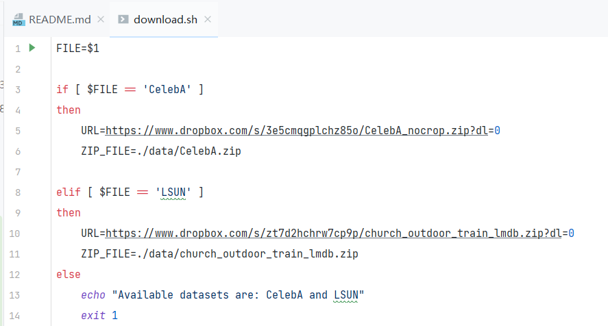
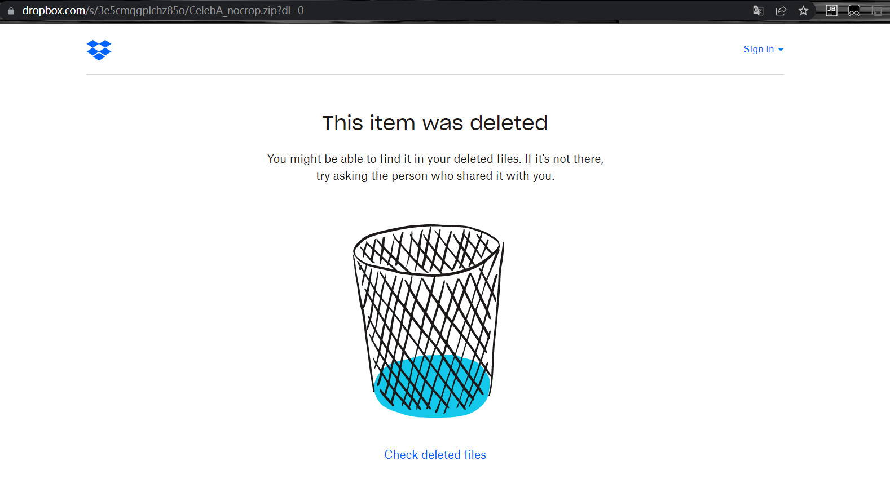
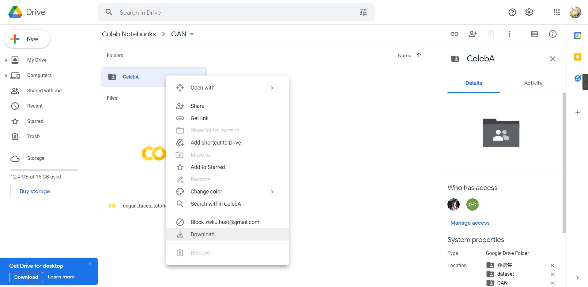
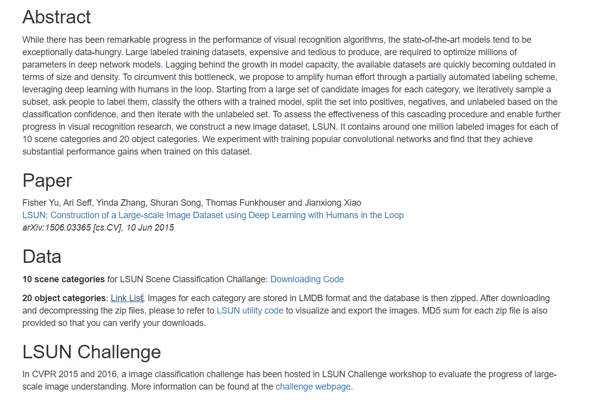
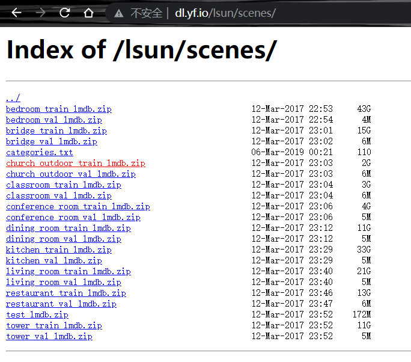
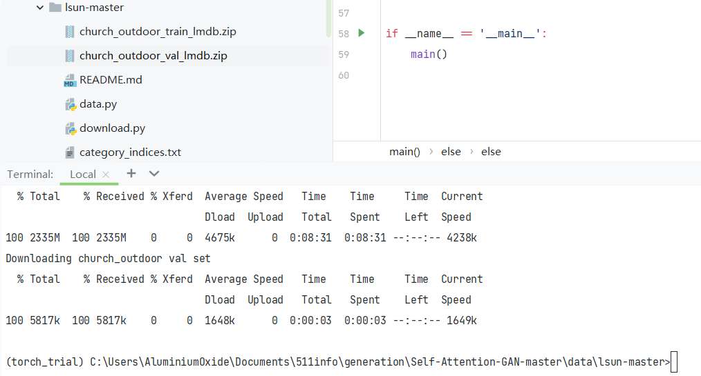
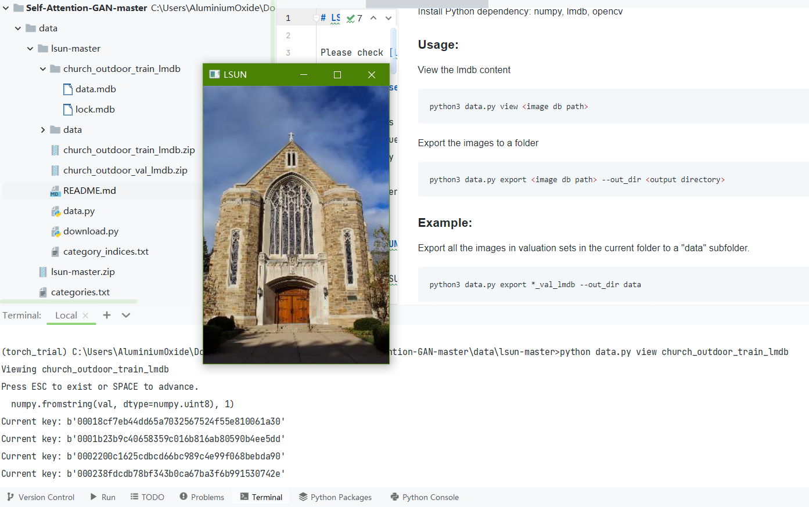
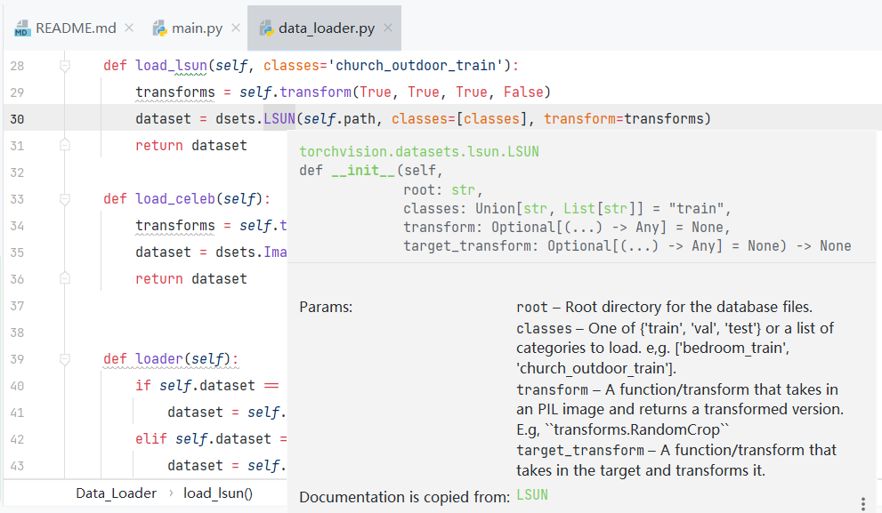

一切都要从这货提供的数据集有问题开始，那么[这里](https://github.com/heykeetae/Self-Attention-GAN)是SAGAN原作者提供的GitHub仓库地址

由于，这货让咱下载数据集的时候



当你开始尝试打开这两个链接



两个box界面都会显示：



那在网上看了一圈，这俩数据集都有点大(CelebA几十寄,LSUN完整版直接媲美ImageNet,一百多寄)，那，，，  
好在注意到这货用的LSUN数据集只是一部分  
church\_outdoor\_train\_lmdb  
这个在官网看只有2G

[CelebA官网](http://mmlab.ie.cuhk.edu.hk/projects/CelebA.html)

[LSUN官网](https://www.yf.io/p/lsun)



您如果对自己的电脑有信心，请移步CelebA官网，直接下载21G数据开始游戏，我就算了

那事情就简单了，下载LSUN的





但是它这玩意的压缩包里储存的都是MDB格式，这里在网页里下载了，后面如果想看还是需要用到它提供的代码

那么直接进入它提供的[GitHub仓库](https://github.com/fyu/lsun) 克隆解压然后根据readme的提示运行下载代码（如果在网页下载了，那这里就不用再下了）

```
python download.py -c church_outdoor
```


下载完之后



然后直接解压到同名目录下，基本上是

- church\_outdoor\_train\_lmdb
    - data.mdb
    - lock.mdb

顺带一提，在解包代码里，建议把这个mapsize改小些，默认1T，蛋是我的硬盘太小了，直接3G空间应该是足够用了（后面测试不改也不报错了，很怪）


然后根据提示执行解包代码（不建议，慢，而且费劲，）

```
python data.py export church_outdoor_train_lmdb --out_dir data
```

或者直接使用view查看

```
python data.py view church_outdoor_train_lmdb
```

那么数据集相关的说的差不多了，可以看SAGAN了



PS：对于使用，pytorch直接提供了对应的工具


