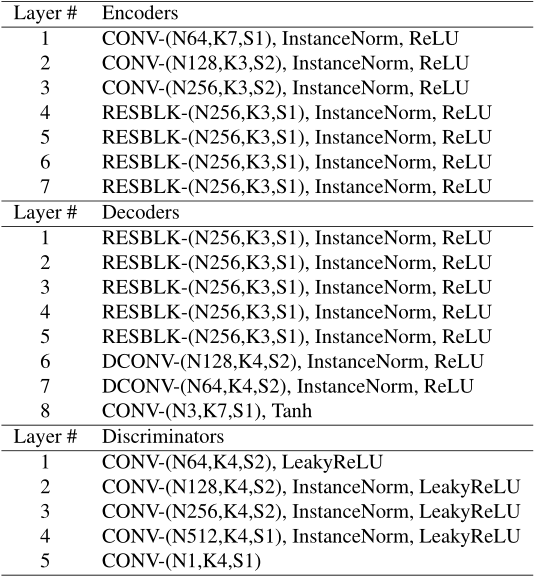

首先是CycleGAN迄今为止，每次实验只针对两个领域

如果将它们扩展到更多领域(比如n个风格)  
CycleGAN 需要训练(n-1)\*n/2对模型  
2>1  
3>3  
4>6  
5>10  
6>15  
……

ComboGAN提出了一种多风格的训练方案  
n个风格只需要训练n对G-D(我这里G-D表示生成器 鉴别器对)  
2>2  
3>3  
4>4  
5>5  
6>6  
……

[\[1712.06909\] ComboGAN: Unrestrained Scalability for Image Domain Translation (arxiv.org)](https://arxiv.org/abs/1712.06909)  
[GitHub链接](https://github.com/AAnoosheh/ComboGAN)

笔者表示训练14个画家之间的区别会产生13\*14/2=91个不同的CycleGAN模型 即182对G-D  
它的只需要14对G-D(不是个数)

ComboGAN 通过将每个模型分为两部分来解决这个问题：一部分处理将一个域转换为公共表示的问题，另一部分处理将公共表示转换为该域的问题。

训练本身分两个交替步骤进行；首先训练D来区分一对或多对真实样本和生成的样本，然后训练生成器用生成的样本愚弄D。如果鉴别器在识别真实照片方面过于强大，那么生成器将快速学习低级“技巧”  
优化问题可以表述为：

读论文的时候发现这玩意是StarGAN后面的!以后再说吧(怎么有种先看denseBlock再看resBlock的感觉)  
StarGAN将来自CycleGAN的生成器和鉴别器融合到一个生成器和鉴别器中，所有域都使用该生成器和鉴别器  
然而，该方法仅适用于人脸属性修改任务，其中所有域都是同一类别图像（人脸）质量的轻微变化

ComboGAN模型

N个风格的模型

一个风格到其他风格的转变过程

对于X到Y风格变换的训练过程

简单来说捏~就是相当于ComboGAN把之前CycleGAN的生成器G分成了生成器-编码 和 生成器-解码(即GE 和 GD)  
在文章末尾直接看到了网络结构,OK省的再从pycharm里打印了

N=通道数，K=卷积核大小，S=step大小
