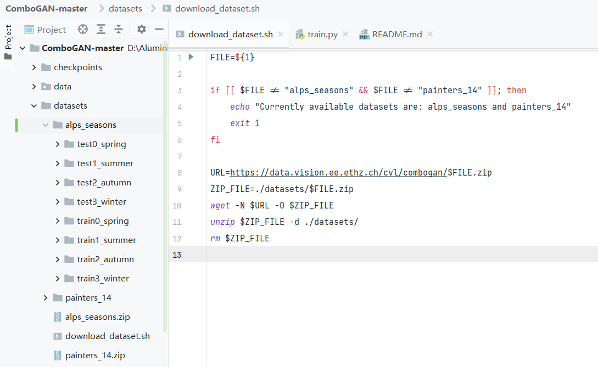
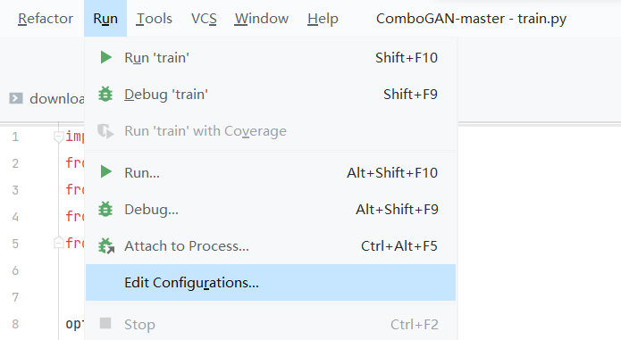
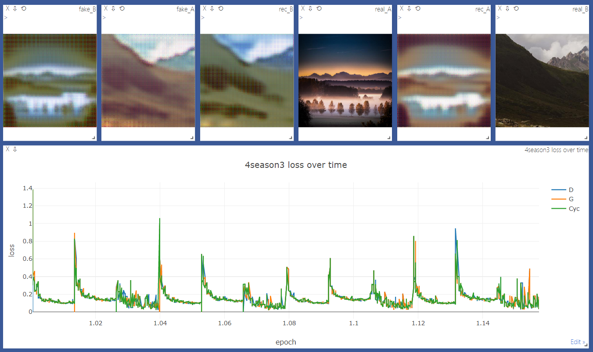
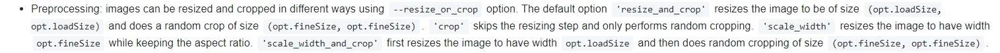

还是直接看代码吧，最然但是，能跑，但是在显示上遇到了一大堆问题，典型集中于visdom的可视化问题上，刚开始以为是因为换电脑自己第一次上没访问外网的问题，后来发现还是不太对劲《因为跑visdom的可以正常出图，但是依旧会源源不断的报304!》  
**_INFO:tornado.access:304 GET /favicon.png  
INFO:tornado.access:304 GET /extensions/MathMenu.js?V=2.7.1  
INFO:tornado.access:304 GET /extensions/MathZoom.js?V=2.7.1_**  
然后啊然后，嗯就这样吧，反正可以正常跑了

重点在看模型结构，第三方库的细节是什么？我不知道  
首先看readme.md

### 1.**环境安装**

- 安装PyTorch和相关依赖，嗯~
- 安装Torch vision？还得源码编译？为什么啊？现在安torch已经自带安装这个了
- 安装[visdom](https://github.com/facebookresearch/visdom)和[dominate](https://github.com/Knio/dominate) # 烫知识:现在用conda安装visdom可以直接因依赖项把dominate安装好
- 克隆此项目

```
git clone https://github.com/AAnoosheh/ComboGAN.git
cd ComboGAN
```

### **2.数据集**

根据文档提示下载数据集? sh文件建议和之前一样咯,  
直接打开datasets/download\_dataset.sh复制里面的 https://data.vision.ee.ethz.ch/cvl/combogan/ 加上 他们提供的数据集名称,也就是这两个

```
https://data.vision.ee.ethz.ch/cvl/combogan/alps_seasons.zip
https://data.vision.ee.ethz.ch/cvl/combogan/painters_14.zip
```

当然下载完后直接解压到datasets目录下类似该种目录结构 # 不这样也行,只要后面调parser就行了



### 3.设置脚本

然后来看看如何进行训练,真的,train脚本简直和CycleGAN一致,完美诠释了 **Code was built upon [CycleGAN](https://github.com/junyanz/CycleGAN)**  
那肯定还是老样子,打开config



下面是我的配置 # 不在visdom展示图像,单纯训练

```
--name 4season --dataroot ./datasets/alps_seasons/ --n_domains 4 --niter 10 --niter_decay 2 --nThreads 0 --save_epoch_freq 2 --display_freq 10 --print_freq 10
```

| parser | parameter | annotate |
| --- | --- | --- |
| \--name | 4season | 储存在checkpoints下的名称 |
| \--dataroot | ./datasets/alps\_seasons/ | 数据集目录 |
| \--n\_domains | 4 | 有多少类(比如季节数据集是四类这里就设成了4) |
| \--niter | 10 | 跑多少遍数据集(推荐50\*domain,即200,但是我这里只是浅尝辄止就不了)  
#虽然我感觉这个名称很不对劲,iter和epoch并不是一个东西 |
| \--niter\_decay | 2 | 经历多少轮迭代进行一次学习率衰减 |
| \--nThreads | 0 | 默认是2线程,但是win上多线程会出毛病就一致调成0线程了  
\# CycleGAN在我之前的笔记本都没调成功,这还敢用多线程? |
| \--save\_epoch\_freq | 2 | 跑多少遍数据集保存一次pth文件,反正我嘛 |
| \--display\_freq | 10 | 多少个iter展示一遍目前的图片(抽取) |
| \--print\_freq | 10 | 多少个iter展示一遍目前的损失 |

那么这样就可以愉快的运行了  
但是如果想要愉快的在训练过程中可视化捏~ 需要把上面的设置再修改一下

```
--name 4season --dataroot ./datasets/alps_seasons/ --n_domains 4 --niter 10 --niter_decay 2 --nThreads 0 --save_epoch_freq 2 --display_freq 10 --print_freq 10 --display_id 1
```

<table><tbody><tr><td>--display_id</td><td>1</td><td>展示到visdom服务器上的窗口ID号,<br>默认是0不显示,如果设置该参数&gt;0,<br>the results and loss plot will appear on a local graphics web server launched by&nbsp;<a href="https://github.com/facebookresearch/visdom">visdom</a></td></tr><tr><td>--no_html</td><td>False</td><td>保持默认值就行 # 烫知识:在add_argument函数中,如果没有设置default 一致设定为bool值False<br>如果设置成True,将不会把结果保存至 [opt.checkpoints_dir]/[opt.name]/web/ 里</td></tr></tbody></table>

然后熟练的在terminal启动visdom,并打开默认网址 http://localhost:8097

```
python -m visdom.server
```

随后运行train.py就可以愉快的训练了,哦等等~优美的visdom拒绝我们如此除暴无礼

**首先** 修改train.py中的变量 dataset\_size > float(len(dataset))  
说实话我不是特别清楚为什么这个变量在master代码里没有定义,变成需要的就行了

```
visualizer.plot_current_errors(epoch, float(epoch_iter)/dataset_size, opt, errors)
```

```
visualizer.plot_current_errors(epoch, float(epoch_iter)/float(len(dataset)), opt, errors)
```

**然后** 去 util/visualizer.py文件中的plot\_current\_errors()中的 左式 修改为 右式

原代码

```
X=np.stack([np.array(self.plot_data['X'])]*len(self.plot_data['legend']),1),
Y=np.array(self.plot_data['Y']),
```

修改 # 可以跑,但依旧不是一个正经修改方案

```
X=np.repeat(np.stack([np.array(self.plot_data['X'])]*len(self.plot_data['legend']),1),4,axis=0),
Y=np.transpose(np.squeeze(np.array(self.plot_data['Y']))).reshape(-1,3),
```

本质上出现的问题是以上两行代码产出的 X{ndarry(N,3)} Y{ndarry(N,3,4)} np.ndim(Y) = 3 # 这里N我表示经历几次显示,可能有出入,但是总之会出大问题!,4是风格数量,因为我用的是季节数据集是4,如果是艺术家数据得改成14(**似乎opt.niter更合适**,算了算了,适可而止,不改了)  
**由于中途出错后调试了几遍,发现visdom要求 X的dim为1或2 且 X的形状要求与Y相同**  
右面的修改方法都是把两个numpy数组修改成{ndarry(3,4\*N)}  
这个调整绝对不是正常的,甚至**我无法保证每一个值都可以对的上,大概率是对不上的!** 函数中self.plot\_data\['legend'\]只有3个(而不是3\*风格数量),我也很绝望啊!  
**这样的结果就是每次显示会出现3条线,而且是竖线,包含了所有风格种类的区间,并且每个连接线都是不对应的**(只能连一条,以这些画plot的软件只会线性穿串串的智商……)  
但总之是能跑了**《虽然可以很明显看的出来这三条线是对不上的！》**



\# 预训练内容不是我该写在这里的《因为我暂时用不到》,秉承闭源的思维我建议大家去阅读论文作者的[github说明文档](https://github.com/AAnoosheh/ComboGAN)最后一段~


