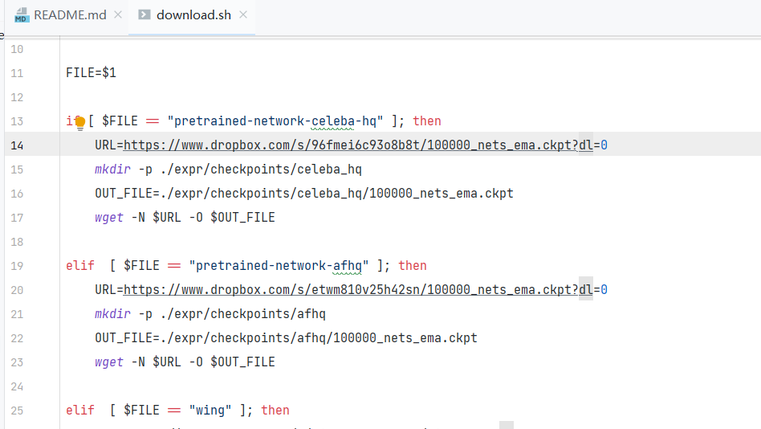
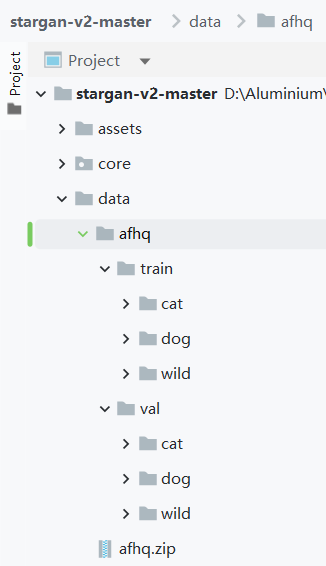
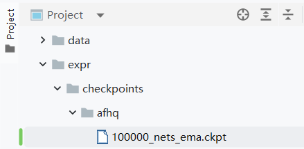

> **这个只是看看readme.md，建议看后面[那个排雷笔记](http://aluminium/allophane.com/index.php/2022/08/04/stargan_3_debug/)捏~**

首先进了[github](https://github.com/clovaai/stargan-v2)喜闻乐见《不是我吐槽，我真怀疑谁能不靠魔法上油管和下载box的文件》

```
git clone https://github.com/clovaai/stargan-v2.git
cd stargan-v2/
```

创建环境，如果以前有环境可直接忽略

```
conda create -n stargan-v2 python=3.6.7
conda activate stargan-v2
```

安装依赖项：（部分可忽略）

```
conda install -y pytorch=1.4.0 torchvision=0.5.0 cudatoolkit=10.0 -c pytorch
conda install x264=='1!152.20180717' ffmpeg=4.0.2 -c conda-forge
pip install opencv-python==4.1.2.30 ffmpeg-python==0.2.0 scikit-image==0.16.2
pip install pillow==7.0.0 scipy==1.2.1 tqdm==4.43.0 munch==2.5.0
```

- pytorch我建议不要建议，直接去[官网](https://pytorch.org/get-started/previous-versions/)找喜欢的版本下载，1.4以上应该是随意没问题
- ffmpeg 这个相当于针对视频的插件《我不知道为什么conda里的和系统里的不一样，会让我的部分音频转码脚本宕机掉》
- opencv、scikit-image老朋友了《如果不出意外，这个用conda安pytorch的时候大概率已经带着安装了，如果提示没有cv2，那就再安一遍》
- pillow、scipy、tqdm、munch这些偏向辅助的库，哪个没安装安一下就完事（大概率是tqdm和munch这两个需要额外安装，前面两个好多时候都已经在各种项目里安过一遍了）

数据集和预训练权重：《这里就直接打开sh脚本看链接好吧！又不是第一次了》

**CelebA-HQ**

```
bash download.sh celeba-hq-dataset
bash download.sh pretrained-network-celeba-hq
bash download.sh wing
```

**AFHQ**

```
bash download.sh afhq-dataset
bash download.sh pretrained-network-afhq
```



直接打开复制链接岂不美哉？注：box虽然不限速但是需要梯子，AFHQ的我建议直接去[飞浆](https://aistudio.baidu.com/aistudio/datasetdetail/49044/0)下载，下载创建一个data文件夹并解压类似右面的文件目录

预训练文件夹放在 ./expr/checkpoints/afhq/ 这个目录下，这个没有什么好建议，我只能说：极光+IDM虽然慢但是作为免费的魔法，方便滴捏~





跑已有的网络

生成图片和插值视频代码（仅针对**AFHQ**数据集，**CelebA**对我这个业余玩家有点大），看到这里应该知道想怎么在pycharm里Edit configuration吧

```
python main.py --mode sample --num_domains 3 --resume_iter 100000 --w_hpf 0 \
               --checkpoint_dir expr/checkpoints/afhq \
               --result_dir expr/results/afhq \
               --src_dir assets/representative/afhq/src \
               --ref_dir assets/representative/afhq/ref
```

评估指标(仅针对afhq)

```
python main.py --mode eval --num_domains 3 --w_hpf 0 \
               --resume_iter 100000 \
               --train_img_dir data/afhq/train \
               --val_img_dir data/afhq/val \
               --checkpoint_dir expr/checkpoints/afhq \
               --eval_dir expr/eval/afhq
```

训练自己的网络（同样也仅针对afhq）  
生成的图像和网络检查点将分别存储在 expr/samples 和 expr/checkpoints 目录中。 **在单个 Tesla V100 GPU 上训练大约需要三天时间《所以咱就看它怎么实现就完事了，跑？我？哈？》**

```
python main.py --mode train --num_domains 3 --w_hpf 0 \
               --lambda_reg 1 --lambda_sty 1 --lambda_ds 2 --lambda_cyc 1 \
               --train_img_dir data/afhq/train \
               --val_img_dir data/afhq/val
```

其中文章还调整了原始的afhq数据集 **我不建议不深入玩的玩家下载这个东西，翻墙的流量是一方面，还有这个数据集大了十倍好家伙！**  
命名为afhq-v2 该数据集与原始afhq数据集的区别如下：

- 使用 Lanczos 下采样而不是最近邻下采样来调整图像大小
- 约 2% 的原始图像已被删除。 所以这个集合现在有 15803 个图像，而原来的有 16130 个。
- 图像保存为 PNG 格式以避免压缩伪影。 这使得文件比原始文件大《所以这就是你6.48G的理由？？？！！！》

可以直接运行这个不能运行的命令 **_bash download.sh afhq-v2-dataset_** 或者直接来这个[国内打不开的链接](https://www.dropbox.com/s/vkzjokiwof5h8w6/afhq_v2.zip?dl=0)里


代码分析之后再补
