直接运行嘛？先把--num\_workers 设置成0再说，然后batchsize调小，调小，不然：

**RuntimeError: \[enforce fail at ..\\c10\\core\\CPUAllocator.cpp:76\] data. DefaultCPUAllocator: not enough memory: you tried to allocate 19909509120 bytes.**

```
    parser.add_argument('--num_workers', type=int, default=0,  # default=4,
                        help='Number of workers used in DataLoader')

    parser.add_argument('--batch_size', type=int, default=2,  # default=8
                        help='Batch size for training')
    parser.add_argument('--val_batch_size', type=int, default=8,  # default=32
                        help='Batch size for validation')
```

然后 E M S 跑！  
才怪嘞！先来这个位置！在ospj() 后追加format() # 这个函数就相当于os.path.join()的缩写

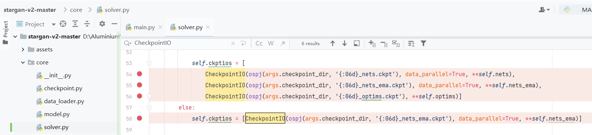

因为原来的代码拼接路径对于我目前win11的电脑完全无效！

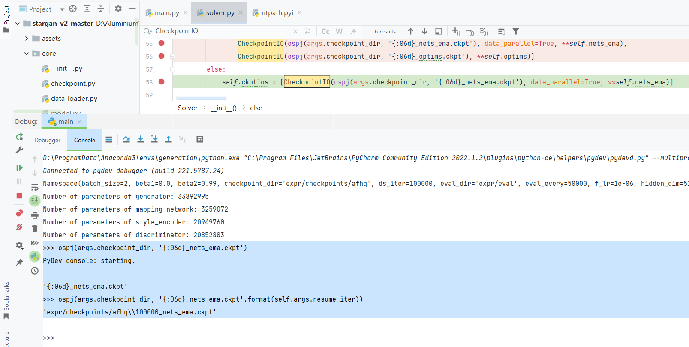

原文

```
            self.ckptios = [
                CheckpointIO(ospj(args.checkpoint_dir, '{:06d}_nets.ckpt'), data_parallel=True, **self.nets),
                CheckpointIO(ospj(args.checkpoint_dir, '{:06d}_nets_ema.ckpt'), data_parallel=True, **self.nets_ema),
                CheckpointIO(ospj(args.checkpoint_dir, '{:06d}_optims.ckpt'), **self.optims)]
        else:
            self.ckptios = [CheckpointIO(ospj(args.checkpoint_dir, '{:06d}_nets_ema.ckpt'), data_parallel=True, **self.nets_ema)]
```

修改

```
            self.ckptios = [
                CheckpointIO(ospj(args.checkpoint_dir, '{:06d}_nets.ckpt'.format(self.args.resume_iter)), data_parallel=True, **self.nets),
                CheckpointIO(ospj(args.checkpoint_dir, '{:06d}_nets_ema.ckpt'.format(self.args.resume_iter)), data_parallel=True, **self.nets_ema),
                CheckpointIO(ospj(args.checkpoint_dir, '{:06d}_optims.ckpt'.format(self.args.resume_iter)), **self.optims)]
        else:
            self.ckptios = [CheckpointIO(ospj(args.checkpoint_dir, '{:06d}_nets_ema.ckpt'.format(self.args.resume_iter)), data_parallel=True, **self.nets_ema)]
```

然后至少可以让测试的程序正常跑起来了(也就是附加参数如下的sample模式代码)

```
--mode sample --num_domains 3 --resume_iter 100000 --w_hpf 0 --checkpoint_dir expr/checkpoints/afhq --result_dir expr/results/afhq --src_dir assets/representative/afhq/src --ref_dir assets/representative/afhq/ref
```

运行成功后会在expr/results/afhq/目录下出现对应的测试图片和视频（如下）

测试代码就不测试了，训练代码看看捏~（也就是按照这个参数输入给main.py开始训练）

```
--mode train --num_domains 3 --w_hpf 0 --lambda_reg 1 --lambda_sty 1 --lambda_ds 2 --lambda_cyc 1 --train_img_dir ./data/afhq/train --val_img_dir ./data/afhq/val
```

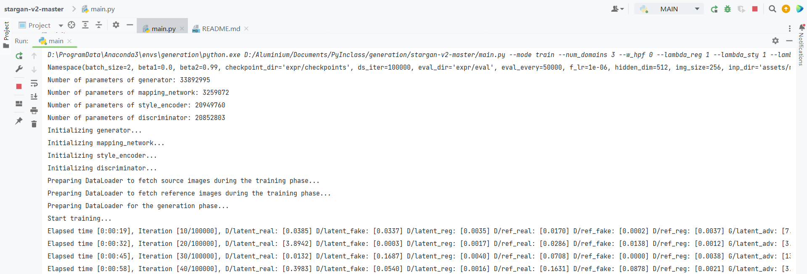

才怪咧~！我能训练的了它？  
本科服务器被端了不好再去用，研导的服务器遇到了和之前一样卡信息交互的问题，自己的电脑和服务器都是垃圾《针对这个网络》  
所以大家看看意思就好，实在着急想看示例会产生什么效果可以追加以下两个参数(信息呈现的频率至少能快一点，不过打印图片也会额外消耗时间降低效率《不过咱也不打算训练完是吧哈哈哈！》)

```
--print_every 2 --sample_every 10
```

这样就可以比较快速的在\\expr\\samples下看到如图所示的示例图像(当然，前面这些iter基本没什么用就是了，全是乱码)

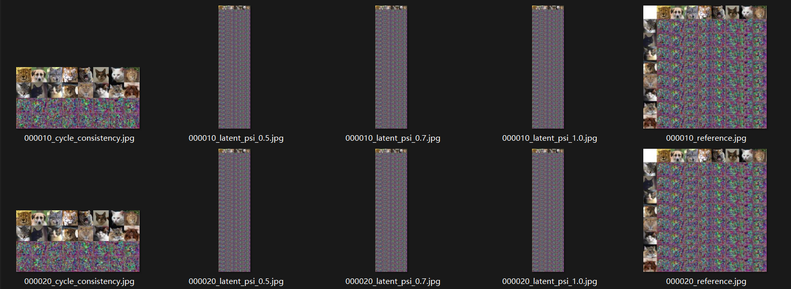

# **KeyboardInterrupt**

那我们现在就来愉快的分析die码吧！

首先在先添加参数然后带参数进去main(args)函数

然后这个函数会直接进入一个solver = Solver(args)

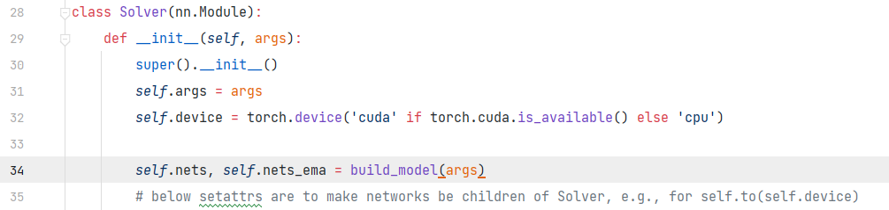

而在solver里主要是buile\_model()来构建模型 (生成器、映射、编码器、鉴别器)

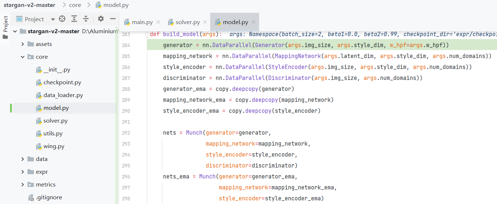

这些模型都来自core/model.py这里已经是原生pytorch的构建方式了，具体细节和文章内的结构描述一致，细节我就不分析了《都看到init和forward了，那我还用多说什么(╯‵□′)╯︵┻━┻！都在笔记1甩了截图》

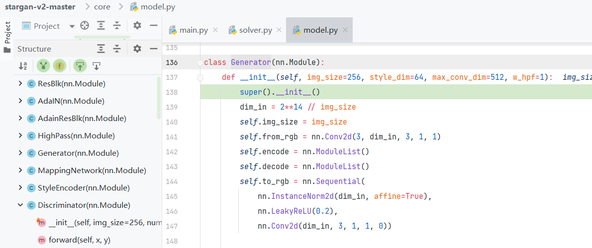

然后是Solver在经历buile\_model()后还在后面设置了优化器并打印信息（都是Adam，优秀！）

随后出来用Munch拼接**src、ref、val** 的 DataLoader

| 类别名称 | 数据集定义方式 | 描述 |
| --- | --- | --- |
| source | ImageFolder # 原生的 | 作为输入的图像(也就是示例中最上面一横排的图像) |
| reference | ReferenceDataset # 自定义的 | 作为风格的图像(也就是示例中最左面一竖列的图像)这货作为目标的风格 |
| val | ImageFolder # 原生的 | 作为验证的(额，，，这个不是重点) |

忽略了eval的哈，那个也是自定义的，但很短也在这没涉及我就不说了

这个函数主要是在 core/data\_loader.py 里 包括但不限于设置transforms、创建数据集、把数据集扔到DataLoader里输出

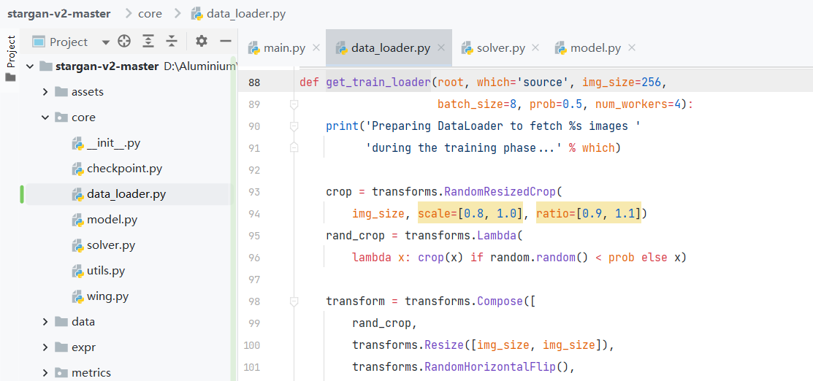

数据集实例化的时候除了reference的数据集是自定义的，其他两个都是pytorch定义方式，那么这里大概就是随机抽取的意思(两个同类别随机的图，然后拼成1组之后计算Style diversification Loss就靠它了)

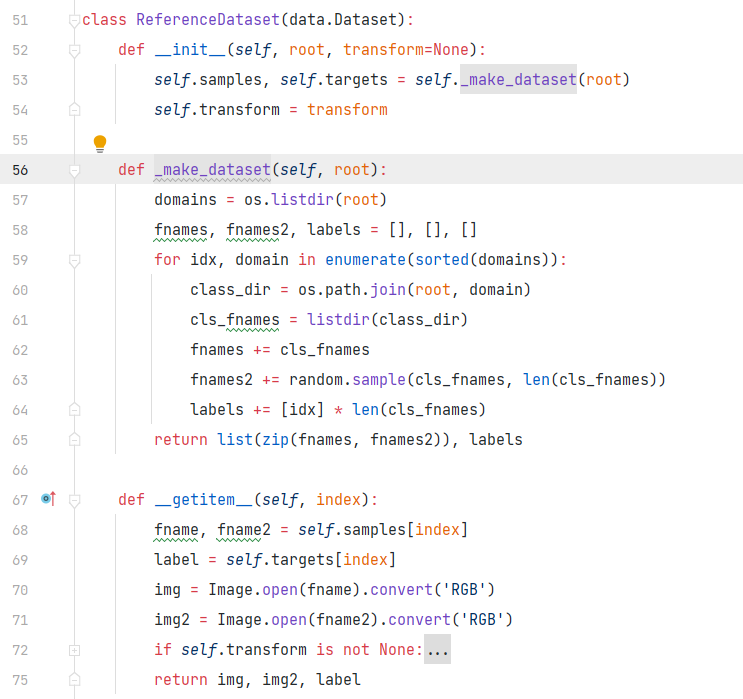

不细说了哈哈

然后出来到3个dataloader都拼装完毕，开始执行训练的部分

```
        solver.train(loaders)
```

然后在获取图片的时候，它还把source、reference组合在一起扔到了一个InputFetcher的对象里，通过调用该对象的\_\_next\_\_()方法,获取**x\_src、y\_src、y\_ref、 x\_ref、x\_ref2、 z\_trg、z\_trg2**

<table><tbody><tr><td><strong>x_src、y_src</strong></td><td>来自source</td></tr><tr><td><strong>x_ref、x_ref2<strong>、</strong>y_ref</strong></td><td>来自reference</td></tr><tr><td><strong>z_trg、z_trg2</strong></td><td>两个根据 <strong>F 映射网络</strong> 输入的 latent_dim长度</td></tr></tbody></table>

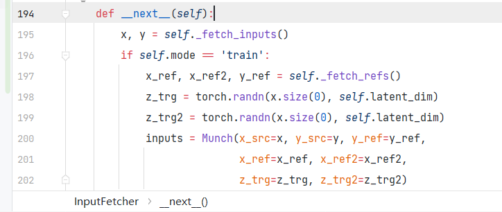

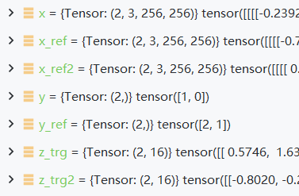

然后又在**solver.train()**中拿出来,大概就是下面这样子的映射关系

| solver.train()中 | InputFetcher方法的输出中 | **InputFetcher**中 | 大小 |
| --- | --- | --- | --- |
| x\_real | inputs.x\_src | x | (BN,3,256,256) |
| y\_org | inputs.y\_src | y | (BN,) |
| x\_ref | inputs.x\_ref | x\_ref | (BN,3,256,256) |
| x\_ref2 | inputs.x\_ref2 | x\_ref2 | (BN,3,256,256) |
| y\_trg | inputs.y\_ref | y\_ref | (BN,) |
| z\_trg | inputs.z\_trg | z\_trg | (BN,latent\_dim) |
| z\_trg2 | inputs.z\_trg2 | z\_trg2 | (BN,latent\_dim) |

然后开始看模型怎么跑，也就是损失怎么计算

那么现在先说一下映射_**《好吧，这不是映射，但我只能看成映射才好理解，那我就只能先这样理解了，淦！》**_

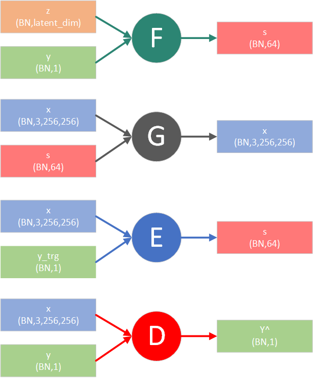

补充部分可能有用的信息

- 生成器G 分为编码器和解码器(前面6个InstanceNormalization的算是编码器，只有输入的X独自干活，后面几个adaptive instance normalization的可以看成X和S一起打工，属于解码器部分
- 映射网络F 《它只有一个，会直接按照Z作为输入输出所有风格的一个矩阵  
    \# (batch, num\_domains, style\_dim)
    - Y？哈？它就是个类别！只在最后取的时候取出对应风格的信息》《甚至不要它，就让网络输出一个大S矩阵再抽取也完全可以！》

- 样式编码器E，这里的输入Y的作用，，，不能说很像吧，只能说几乎一样！  
    也是X进去，按照第一个笔记最后那样的结构，然后输出一个类似映射网络F的矩阵 # (batch, num\_domains, style\_dim)
    - 《然后Y的左右只是在这些矩阵里面取出来对应类别的！》
- 鉴别器D ？我还能多说什么？这次输出的不一样（变成2维的了）  
    (batch, num\_domains)  
    但是Y的用处完全没变！《只在最后用来抽出来对应的类别》

**简单来说就是除了除了生成器确实需要两个输入(一个图像，一个风格)其他这三个网络其实都可以把顺带着人进来的类别Y直接扔了！**

然后具体迭代还是之后甩视频补吧，不往这放了
