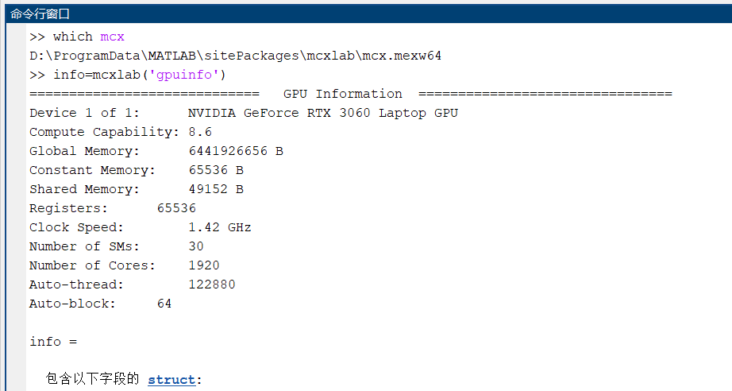
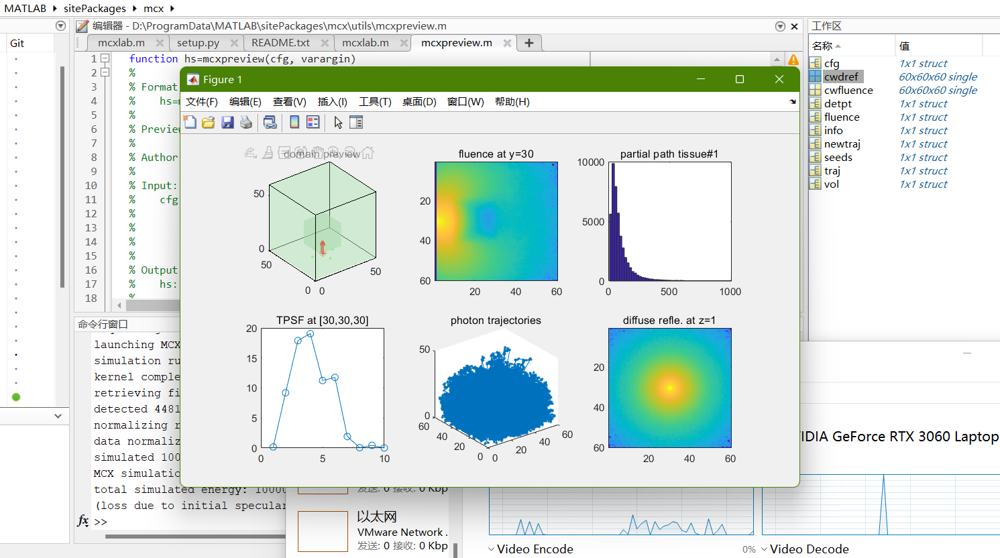
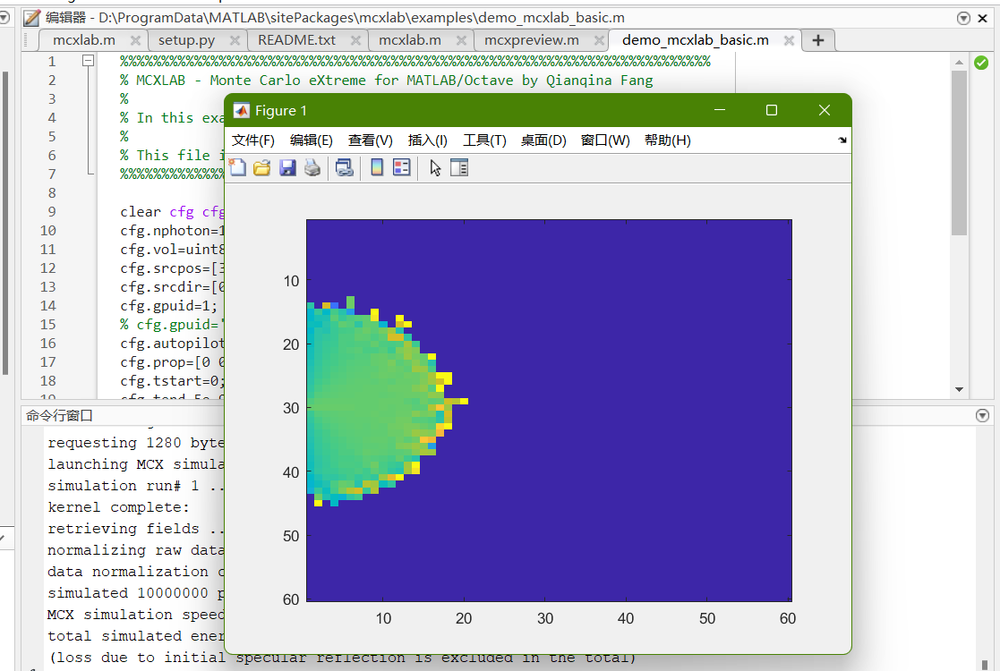

## MCXLAB

MCXLAB 是 MEX 的原生 MEX 版本，适用于 Matlab 和 GNU Octave。它将整个 MCX 代码编译成一个 MEX 函数，可以在 Matlab 或 Octave 中直接调用。 MCX 中的输入和输出文件被 MCXLAB 中方便的内存结构变量替换，从而使其更易于使用和交互。 Matlab/Octave 还提供了方便的绘图和数据分析功能。使用 MCXLAB，您的分析可以在不涉及磁盘文件的情况下得到简化和加速。

由于 MCXLAB 包含与 MCX 二进制文件中的 GPU 计算完全相同的计算代码，因此预期 MCXLAB 在运行模拟时具有相同的性能。默认情况下，我们编译 MCXLAB 支持记录检测到的光子部分路径长度（即“make det”选项）。此外，我们还提供“mcxlab\_atom”：mcxlab 的原子版本，其编译方式与 MCX 的“make detbox”类似。它支持使用通过将“cfg.sradius”输入参数设置为正数启用的共享内存的原子操作。

### 2.1 安装

MCXLAB 工具箱的核心功能由 MATLAB 函数 mcxlab.m 和 mcx.mex\* mex 文件提供。 mcxlab.m 脚本提供 MCX 数据的预处理/后处理，mcx.mex 文件执行基于 GPU 的实际模拟。

MCXLAB 的系统要求与 MCX 相同：您必须确保您拥有支持 CUDA 的显卡和正确配置的显卡驱动程序（您可以先运行标准 MCX 二进制文件以测试您的系统是否能够运行 MCXLAB） .当然，您需要安装 Matlab 或 Octave。Octave算是一个开源的 类matlab 不过现在用的人比较少

**设置好 CUDA 工具包和 NVIDIA 驱动程序后，您可以使用 addpath 命令将“mcxlab”目录添加到您的 Matlab/Octave 搜索路径**。如果要永久添加此路径，请使用“pathtool”命令，或者编辑你的 startup.m (~/.octaverc for Octave)。

如果一切正常，在 Matlab/Octave 中键入“help mcxlab”将打印帮助信息。如果您看到任何错误，尤其是任何缺少的库，请确保您已下载为您的平台构建的匹配版本。

### 2.2 help info

MCXLAB 接受以下输入参数（输入 help mcxlab 以显示）

**这块之后再细看**

### 2.3 verify MCXLAB installation

要验证 MCXLAB 是否已安装并与您的系统兼容，请先运行**(等会补一下去夜间版拿mcx.mex)**

```
which mcx
```

在 MATLAB 或 GNU Octave 中。 如果上述命令打印了您已安装的 mcx.mex\* 文件的路径，则表示 MCXLAB 现在已安装在您的 MATLAB 或 Octave 上。

接下来，您需要验证您的 GPU 硬件是否为 MCX 正确配置。 跑以下代码**（当然，这和进常规mcx/bin下开prompt点 mcx -L没什么大区别）**

```
info=mcxlab('gpuinfo')
```

如果您的系统有一个 NVIDIA GPU 并且配置正确，您应该得到非空输出。 否则，请验证您的 GPU 驱动程序是否已正确安装，并在需要时重新安装。



如果没把那个夜间版添加到路径，我真的不知道应该怎么玩

同时，  
咱们还需要把github版的\\mcx\\utils（对我说是D:\\ProgramData\\MATLAB\\sitePackages\\mcx\\utils）添加到路径  
在github上将Iso2Mesh的[项目](https://github.com/fangq/iso2mesh.git)拷贝下来，并把其添加到路径

```
D:\ProgramData\MATLAB\sitePackages\iso2mesh
D:\ProgramData\MATLAB\sitePackages\mcx\utils
D:\ProgramData\MATLAB\sitePackages\mcxlab
```

不然，，，函数或变量 'mcx\*\*\*\*\*\*\*\*\*' 无法识别（后仰）  
在路径添加好后，回2.2愉快的运行示例！



OK

### 2.4 first example

这难道不是2.2做的嘛？那个算第零个？那没事了

MCXLAB：第一个例子  
让我们看一下 mcxlab/examples/demo\_mcxlab\_basic.m 演示脚本中提供的最简单的示例之一，那，略



在上面的示例中，您可以看到只需要几行代码就可以定义一个功能齐全的 mcxlab 仿真。 除“cfg.gpuid”和“cfg.autopilot”外，上面定义的cfg参数中的所有子字段都是最低要求的参数。

### 2.5 test built-in examples

在 mcxlab/example 文件夹中，我们提供了十几个内置示例脚本。 在这些示例脚本中，我们向用户展示了如何使用 mcxlab 创建和执行模拟并显示结果。 当您使用自己的模拟自定义这些示例时，阅读这些示例并了解每个设置的目的非常有帮助。

\==== demo\_mcxlab\_basic.m ====

在这个例子中，我们展示了 MCXLAB 最基本的用法。这包括如何定义输入配置结构、启动 MCX 模拟以及解释和绘制结果数据。

\==== demo\_validation\_homogeneous.m ====

在此示例中，我们使用立方域中的均质介质验证 MCXLAB。这正是\[Fang2009\]的图5所示的例子。

您还可以使用具有高 g 值的替代光学特性来观察两种散射/g 配置之间的相似性。

\==== demo\_validation\_heterogeneous.m ====

在此示例中，我们使用异构验证 MCXLAB 求解器  
域和扩散模型的解析解。我们还演示了如何使用亚像素分辨率来细化异质性的表示。该域由一个 6x6x6 厘米的盒子组成，盒子的中心嵌入了一个直径为 2 厘米的球体。

该测试与 \[Fang2010\] 中用于图 3 的测试相同。

\==== demo\_fullhead\_atlas.m ====  
在这个例子中，我们在全头图集模板（USC 19.5 年组\[Sanchez2012\]）中演示了光传输模拟。  
该演示与 \[TranYan2019\]（已提交）中用于图 9(a) 的 MCX 模拟相同。

\==== demo\_mcxyz\_skinvessel.m ====  
在这个例子中，我们比较了 Steve Jacques 博士编写的 MCX 和 mcxyz。可以在 https://omlc.org/software/mc/mcxyz/index.html 找到相同的基准

\==== demo\_digimouse\_sfdi.m ====  
这使用 Digimouse 地图集模拟了宽场 SFDI 源。图集中有 21 种组织类型。

\==== demo\_4layer\_head.m ====

在这个例子中，我们使用 MCXLAB 模拟了一个 4 层的大脑模型。  
我们将研究具有和不具有边界反射（外部和内部）的解决方案之间的差异，并向您展示如何显示和分析结果数据。

\==== demo\_mcxlab\_srctype.m ====  
此演示脚本展示了如何在您的模拟中使用 9 种不同类型的源。这 9 种光源类型包括笔形光束、各向同性光源、高斯光束、均匀平面光源、均匀圆盘光源、傅里叶图案照明（空间频域光源）、反正弦分布光束、均匀锥形光束和任意光图案（由 2D图片）。

\==== demo\_mcxlab\_2d.m ====  
在此示例中，我们展示了如何使用 MCX 运行 2D 模拟。您必须定义一个具有一个单维（长度为 1）的 3D 数组。不幸的是，如果您将 z 定义为单例，matlab 将使该数组成为 2D 而不是 3D，因此我们必须将其转换为第一维单例。

\==== demo\_photon\_sharing.m ====  
该脚本演示了“光子共享”功能（Yao&Yan 等人，2019，Photonics West），以同时创建多个图案化源的正向解决方案。

\==== demo\_replay\_timedomain.m ====  
在这个例子中，我们展示了如何使用重放来获得时间分辨的雅可比 - 将 cfg.replaydet 设置为 -1 来重放所有检测器。

\==== demo\_replay\_vs\_pmc\_timedomain.m ====  
在这个例子中，我们比较了扰动 MC 和重放在预测时间分辨测量变化与层中 mua 变化的关系。

\==== demo\_sphere\_cube\_subpixel.m ====

在这个例子中，我们演示了如何使用亚像素分辨率来表示问题域。该域由一个 6x6x6 厘米的盒子组成，盒子的中心嵌入了一个直径为 2 厘米的球体。

\==== demo\_mcxlab\_basic.m ====

In this example, we show the most basic usage of MCXLAB. This include how to define the input configuration structure, launch MCX simulations and interpret and plotting the resulting data.

\==== demo\_validation\_homogeneous.m ====

In this example, we validate MCXLAB with a homogeneous medium in a cubic domain. This is exactly the example shown in Fig.5 of \[Fang2009\].

You can also use the alternative optical properties that has a high g value to observe the similarity between the two scattering/g configurations.

\==== demo\_validation\_heterogeneous.m ====

In this example, we validate the MCXLAB solver with a heterogeneous  
domain and the analytical solution of the diffusion model. We also demonstrate how to use sub-pixel resolution to refine the representation of heterogeneities. The domain is consisted of a 6x6x6 cm box with a 2cm diameter sphere embedded at the center.

This test is identical to that used for Fig. 3 in \[Fang2010\].

\==== demo\_fullhead\_atlas.m ====  
In this example, we demonstrate light transport simulation in a full-head atlas template(USC 19.5 year group\[Sanchez2012\]).  
This demo is identical to the MCX simulation used for Fig.9(a) in[TranYan2019](submitted).

\==== demo\_mcxyz\_skinvessel.m ====  
In this example, we compare between MCX and mcxyz written by Dr. Steve Jacques.The same benchmark can be found at https://omlc.org/software/mc/mcxyz/index.html

\==== demo\_digimouse\_sfdi.m ====  
This simulates a widefield SFDI source using the Digimouse atlas. There are 21 tissue types in the atlas.

\==== demo\_4layer\_head.m ====

In this example, we simulate a 4-layer brain model using MCXLAB.  
We will investigate the differences between the solutions with and witout boundary reflections (both external and internal) and show you how to display and analyze the resulting data.

\==== demo\_mcxlab\_srctype.m ====  
This demo script shows how to use 9 different types sources in yoursimulations. These 9 source types include pencil beam, isotropic source, Gaussian beam, uniform plannar source, uniform disk source, Fourier pattern illumuniation (spatial frequency domain sources), arcsine distribution beam, uniform cone beam, and an arbitrary light pattern (defined by a 2D image).

\==== demo\_mcxlab\_2d.m ====  
In this example, we show how to use MCX to run a 2D simulation. You must define a 3D array with one singleton dimension (with length 1).unfortunately if you define z as singleton, matlab will make the array 2D instead of 3D, so we have to purmute it to make the 1st dimension singleton.

\==== demo\_photon\_sharing.m ====  
This script demonstrates the "photon sharing" feature (Yao&Yan et al, 2019, Photonics West) to simultaneously create forward solutions of multiple patterned source.

\==== demo\_replay\_timedomain.m ====  
In this example, we show how to use replay to obtain time-resolved Jacobians - setting cfg.replaydet to -1 to replay all detectors.

\==== demo\_replay\_vs\_pmc\_timedomain.m ====  
In this example, we compare perturbation MC and replay in predicting time-resolved measurement change with respect to mua change in a layer.

\==== demo\_sphere\_cube\_subpixel.m ====

In this example, we demonstrate how to use sub-pixel resolution to represent the problem domain. The domain is consisted of a 6x6x6 cm box with a 2cm diameter sphere embedded at the center.

### 2.6 GPU speed contest

在此的[网页](http://mcx.space/gpubench) 就不是我该玩的了

我们维护了一个 GPU 基准数据库，用于表征各种 GPU 架构和显卡的 MCX/MCXLAB 仿真速度。 此数据库中的速度数据由我们的开发人员提交或由我们的用户（如您）贡献。 要参与，请下载 MCXLAB 并在 MATLAB 中运行 mcx\_gpu\_contest.m 脚本（在示例下），或运行 speedcontest/mcxcontest 脚本（Windows 需要 Cygwin 或 MSYS2）。

我们使用 3 个内置基准（使用“mcx --bench”列出）、“cube60”、“cubesph60b”和“cube60planar”来表征 mcx 支持的一系列域设置和模拟类型的整体速度。 这个 gpu 竞赛脚本的分数基本上是 3 个基准中以光子/毫秒为单位的速度的总和。 分数越高，mcx 在被测 GPU 上的整体性能越好。

## 3 MCXSTUDIO

MCXStudio 是一个易于使用的跨平台 GUI，可与 MCX、MMC 和 MCXCL 一起使用。 单击下面的项目以显示帮助信息

Introduction File Structure GPU Query Video Tutorials

## 4 INSTALLATION

MCX 支持 2010 年之后 NVIDIA 生产的几乎所有 GPU。我们发布的软件包中提供的预编译二进制文件支持“Fermi”（大约 2010 年）和 NVIDIA 生产的更新的 GPU，甚至包括未来几代。

请使用以下步骤确定您的计算机上是否正确安装了所有需要的库。**（但我感觉我不用确定）**

### 4.1 GPU Hardware

您的计算机必须具有支持 CUDA 的 GPU。  
一般来说，NVIDIA在2010年以后生产的所有显卡都支持CUDA。但是，如果你使用集成GPU（Intel）或AMD GPU，你可能不会运行MCX（你应该考虑MCXCL）  
GPU 中的内核（流处理器）越多，通常意味着模拟速度越快。另一方面，MCX 不需要大的 GPU 内存。因此，除非您需要模拟具有许多时间门的非常大的域，否则并不完全需要 NVIDIA Tesla 卡。如果您不确定您的操作系统是什么类型的显卡，请使用以下说明：**（但我感觉我不需要）**

- Windows：下载并运行免费软件 gpu-z。
- Mac OSX：打开终端，运行命令“system\_profiler”
- Linux：打开终端，运行命令“lspci | grep -i --color 'vga|3d|2d'”

您应该会看到至少一张可用的 NVIDIA 显卡。此外，您还应该为显卡安装了正确的驱动程序。有关详细信息，请参阅您的显卡安装指南。

### 4.2 GPU driver

您必须安装正确的 GPU 驱动程序才能让 MCX 访问您的 GPU 硬件。如果您已经使用 NVIDIA GPU 进行计算机显示和图形渲染，这通常作为计算机安装的一部分完成。  
要下载最新的驱动程序，请使用[以下 URL](https://www.nvidia.com/Download/index.aspx)：

如果您在使用计算机上的显卡时遇到问题，这通常表示显卡驱动程序有问题，您必须在使用 MCX 之前修复显卡驱动程序问题。  
从 MCX 2017.3 开始，不再需要额外安装 CUDA 库。 CUDA 库现在直接内置到 MCX/MCXLAB 二进制文件中。  
对于 Windows 用户，从 1.0-beta 开始，我们在二进制包中包含了所需的库文件（Windows 上的 .dll）。但是，如果您运行 mcx 并收到一条抱怨“cuda\*.dll is missing”的错误消息，请在搜索引擎中搜索此文件名并找到下载链接。下载 dll 文件后，应将其保存在 Windows 文件夹下（通常为 C:\\Windows）。

### 4.3 Initial test

一旦您验证了您的 GPU 硬件并正确安装了 GPU 驱动程序，您可以通过以下命令测试 MCX

```
 mcx-L
```

在终端中输入（在 Windows 中，开始菜单\\运行\\cmd）。 您应该会看到支持的显卡列表。 如果您看到错误，则表示您的硬件不支持 MCX，或者缺少 CUDA 库。

您也可以在您的计算机上运行 nvidia 工具“nvidia-smi”，以确保您可以看到列出的支持 CUDA 的 GPU。 如果没有，可能是您的 NVIDIA 驱动程序或 GPU 硬件未正确安装。**（但我感觉这些刚才不是试过了嘛）**

## 5 PREPARATION

单击下面的项目以显示帮助信息

### 5.1 JSON input

如果在命令行模式下使用 MCX，强烈建议使用 JSON 格式的输入文件来定义模拟。 JSON 是一种源自 Javascript 的基于文本的数据格式。 它是人类可读的并且易于扩展。 在 MCX 的 JSON 输入文件中，输入信息是不言自明self-explanatory的

```
{
   "Domain": {
	"VolumeFile": "semi60x60x60.bin",
        "Dim":    [60,60,60],
        "Media": [
             {"mua": 0.00, "mus": 0.0, "g": 1.00, "n": 1.0},
             {"mua": 0.005,"mus": 1.0, "g": 0.01, "n": 1.0}
        ]
    },
    "Session": {
	"Photons":  1000000,
	"RNGSeed":  29012392,
	"ID":       "qtest"
    },
    "Forward": {
	"T0": 0.0e+00,
	"T1": 5.0e-09,
	"Dt": 5.0e-09
    },
    "Optode": {
	"Source": {
	    "Pos": [29.0, 29.0, 0.0],
	    "Dir": [0.0, 0.0, 1.0],
	    "Type": "pencil",
	    "Param1": [0.0, 0.0, 0.0, 0.0],
	    "Param2": [0.0, 0.0, 0.0, 0.0]
	},
	"Detector": [
	    {
		"Pos": [29.0,  19.0,  0.0],
		"R": 1.0
	    }
	]
    }
}
```

### 5.2 Define the volume

卷文件(volume file)是一个二进制文件，代表一个3D体积的组织信息。 文件的每个字节都是体素的标签——标签值 (0-255) 是体素组织类型的索引。

卷文件在 JSON 输入文件中由“域”部分中的“VolumeFile”标签指定。 如果使用传统输入文件，则卷文件在第 4 行中指定。

### 5.3 Domain shape descriptors （略）

没仔细写，想了解域形状描述符，看示例去

### 5.4 Legacy input file （略）

旧版本的 MCX 支持扩展  
tMCimg 使用的输入文件格式 (.inp) 的版本。 但是，我们正在逐步取消对 .inp 的支持，并强烈建议用户采用 JSON 格式 (.json) 输入文件。 许多高级 MCX 选项仅在 JSON 输入格式中受支持。旧版输入文件如下所示

```
1000000              # total photon, use -n to overwrite in the command line
29012392             # RNG seed, negative to generate
30.0 30.0 0.0 1      # source position (in grid unit), the last num (optional) sets srcfrom0 (-z)
0 0 1 0              # initial directional vector vx,vy,vz, last number is the focal length, nan for isotropic launch
0.e+00 1.e-09 1.e-10 # time-gates(s): start, end, step
semi60x60x60.bin     # volume ('unsigned char' format)
1 60 1 60            # x voxel size in mm (isotropic only), dim, start/end indices
1 60 1 60            # y voxel size, must be same as x, dim, start/end indices
1 60 1 60            # y voxel size, must be same as x, dim, start/end indices
1                    # num of media
1.010101 0.01 0.005 1.37  # scat. mus (1/mm), g, mua (1/mm), n
4       1.0          # detector number and default radius (in grid unit)
30.0  20.0  0.0  2.0 # detector 1 position (real numbers in grid unit) and individual radius (optional)
30.0  40.0  0.0      # ..., if individual radius is ignored, MCX will use the default radius
20.0  30.0  0.0      #
40.0  30.0  0.0      #
pencil               # source type (optional)
0 0 0 0              # parameters (4 floats) for the selected source
0 0 0 0              # additional source parameters
```

## 6 RUN

### 6.1 show mcx help

不带参数运行“mcx”会打印帮助信息，包括所有支持的命令行选项。 这也是安装 mcx 后第一个测试的命令。 如果您看到错误，例如缺少库，这通常表明您的 NVIDIA 驱动程序或 CUDA 工具包有问题 （但我觉得您的文档里说了好多遍了）

### 6.2 list GPU

运行“mcx -L”会列出您计算机上所有支持的 GPU，比如（算了，这个说好多遍了）  
fangq@wazu:mcx/bin$ ./mcx -L

### 6.3 autopilot mode

命令“mcx -A -n 1e6 -f input.json”要求 mcx 使用输入文件“input.json”中指定的设置 (-f) 模拟 10^6 个光子 (-n)； 它还要求 mcx 自动配置 (-A) 线程和块大小以最大化速度。 如果模拟成功完成，将在当前文件夹中创建一个名为“input.json.mc2”的输出。

在自动模式下，mcx 使用内置的 huristic 算法来确定线程和块大小。 目标是启动尽可能多的线程以保持所有 GPU 硬件繁忙，从而实现效率最大化

### 6.4 session name and voxel size

命令“mcx -A -n 1e6 -f input.json -s test -u 0.5”在前一个命令的基础上增加了两个附加选项：

\-s test：不是将输出文件写为 input.json.mc2，而是将输出文件命名为 test.mc2  
\-u 0.5：默认情况下，mcx 在体积中假定各向同性 1 x 1 x 1 mm^3 体素； 如果您的体积具有大于或小于 1 毫米的体素尺寸，您可以通过 -u 标志指定它。 这里我们说所有体素的大小都是 0.5 x 0.5 x 0.5 mm^3

### 6.5 manual thread configuration

在此命令“mcx -t 10240 -T 32 -n 1e6 -f input.json”中，我们不使用自动模式 (-A)，而是使用 -t 和 -T 标志分别明确指定线程和块大小。

## 7 OPTION

还是直接甩表格吧，到时候啥时候能用上啥时候用

[MCXoptions](http://aluminium/allophane.com/wp-content/uploads/2022/09/MCXoptions.xlsx)[下载](http://aluminium/allophane.com/wp-content/uploads/2022/09/MCXoptions.xlsx)

## 8 OUTPUT

总体而言，MCX/MCXLAB 产生 3 种类型的输出数据：

1. 体积数据
2. 检测到的光子数据，以及
3. 光子轨迹

第一种类型的输出通常存储为 3D、4D 或 5D 单精度浮点数组。默认情况下，此体积输出是作为 4D 数组的归一化注量率（W/mm^2 或 J/(s\*mm^2)），前 3 个维度为 x/y/z，最后一个维度是时间-门。但是，通过使用“--outputtype”标志或 cfg.outputtype，也可以要求 MCX 输出 mua 的通量、能量密度或雅可比行列式（在回放模式下）。这些输出也是 3D 或 4D 阵列的形式。当使用“光子共享”时，对应于所有同时模拟的源模式的输出数据被存储为一个 5D 数组。体积数据的默认输出文件格式是“.mc2” - 以列优先顺序的 3D/4D/5D 浮点缓冲区的简单二进制缓冲区转储。强烈建议使用“-F jnii”或“-F bnii”或“-F nii”将此输出存储为 JSON、二进制 JSON 或 NIfTI 格式，以提高可移植性和可读性（如果保存为 .jnii）。这些文件可以分别使用 loadmc2、loadjson 或 loadbj 命令加载到 MATLAB。可以通过设置“--save2pt 0”或 cfg.issave2pt=0 来禁用此输出。

第二种类型的输出通常以二进制 2D 数组的形式存储在“.mch”（MC 历史文件）中编码。 .mch 文件包含一个简单的 256 字节标题，后跟一个 Np x Nc 2D 浮点数组，其中 Np 是检测到的光子数，Nc 是每个光子数据数或列的数量。每光子数据包括检测器的索引、部分路径长度、部分散射计数等。可以使用 -w 或 --savedetflag 指定输出列，后跟一系列字符。如果设置了 -q 或 --saveseed，则在主数据表之后有一个 Np x Nb 字节数组块，存储每个光子 RNG 种子，其中 Nb 是每个 RNG 种子的字节数。默认输出文件格式为 .mch，但也建议您使用 -F jnii 或 -F bnii 将它们保存为 JSON 或二进制 JSON 格式。如果使用 jnii 或 bnii 输出，则检测到的光子数据存储在“MCXData”根对象下的“PhotonData”键下，如果需要，光子种子存储在“Seed”键下。可以通过设置 --savedet 0 或忽略 mcxlab 的第二个输出来禁用此输出。

第三种类型的输出也默认存储在“.mch”格式的文件中，但为了更好的管理重命名为 .mct。 .mct 文件的格式与 .mch 完全相同，包含 Np x 6 浮点数组的 2D 表，其中 Np 是模拟光子，列中的字段是 photonid、x、y、z、权重、保留当使用 -F jnii 或 -F bnii 时，此输出将与第二个输出文件合并，并且所有轨迹数据都存储在“MCXData”根对象下的“Trajectory”键下。此输出可以通过“-D M”或要求 mcxlab 返回第 5 个输出来启用。

### 8.1 Fluence (\*.mc2)

MCX 默认输出 3D 通量分布（除非使用“-S 0”）。或者，如果用户指定“-O F”，则输出体积为通量(fluence)；如果使用“-O E”，则输出量为能量存款(energy deposit)；如果使用“-O J”或“-O T”，则输出为吸收灵敏度曲线(absorption sensitivity profile)，即 mua 的雅可比。

体积输出文件后缀为“.mc2”，是一个大小为（Nx x Ny x Nz x Nt x 4）字节的二进制文件，其中Nx/Ny/Nz是输入体积的维度分别为x/y/z方向，Nt为时间门总数，由ceil(tend-tstart)/tstep)计算，数字4代表单精度浮点数的字节长度。 first (Nx x Ny x Nz) 浮点数（每个 4 字节）是累积的能量分布，以 (1/(s\*mm^2)) 为单位，第一次门（平均在时间门）；然后是第二个门，以此类推。

默认情况下，MCX 的通量/通量输出被归一化以产生时域格林函数或时域点扩展函数 (TPSF) - 即在 t=0 时单位能量的脉冲输入的解。可以使用“-U 0”禁用标准化。

mc2 文件可以使用 mcx/utils 文件夹下提供的 loadmc2() 函数加载到 matlab 中。请运行 help loadmc2 了解详细信息。

要将通量输出转换为通量，只需将解乘以输入文件中定义的时间门宽度 tstep。类似地，将 tstep 从 fluence 解中分离出来会产生通量。

### 8.2 Detected photon (\*.mch)

默认情况下，MCX 会保存检测到的光子的信息。也可以通过在命令行中附加“-d 1”来启用此功能。带有检测到的光子信息的输出文件被命名为“session\_name.mch”。  
可以使用 mcx/utils 文件夹下提供的 loadmch() 函数将 mch 文件加载到 matlab 中。请运行 help loadmch 了解详细信息。  
mch 文件是一个包含以下 3 个块的二进制文件：一个 256 字节的标头，后跟一个用于部分路径长度的浮点数块，然后是一个记录随机数生成器 (RNG) 的字节数组块每个检测到的光子的种子数据（每个光子 20 个字节）。一个 mch 文件可能包含上述 3 块数据块的多次重复。  
标头包含以下信息

```
typedef struct MCXHistoryHeader{
	char magic[4];                 /** magic bits= 'M','C','X','H' */
	unsigned int  version;         /** version of the mch file format */
	unsigned int  maxmedia;        /** number of media in the simulation */
	unsigned int  detnum;          /** number of detectors in the simulation */
	unsigned int  colcount;        /** how many output files per detected photon */
	unsigned int  totalphoton;     /** how many total photon simulated */
	unsigned int  detected;        /** how many photons are detected (not necessarily all saved) */
	unsigned int  savedphoton;     /** how many detected photons are saved in this file */
	float unitinmm;                /** what is the voxel size of the simulation */
	unsigned int  seedbyte;        /** how many bytes per RNG seed */
        float normalizer;              /** what is the normalization factor */
	int respin;                    /** if positive, repeat count so total photon=totalphoton*respin; if negative, total number is processed in respin subset */
	unsigned int  srcnum;          /** number of sources for simultaneous pattern sources */
	unsigned int  savedetflag;     /** detected photon output specifier */
	int reserved[2];               /** reserved fields for future extension */
};
```

在 header 之后，总共有 savedphoton\*colcount words (32bit) 记录表示检测到的 photon info，每个 photon 占用按被检测到的顺序保存的“colcount”个 word。典型的检测到的光子记录包括以下内容：  
_DetID、ScatNum、PP1、PP2、…、PPN_  
其中DetID是一个整数，表示捕获光子的探测器的索引； ScatNum 记录光子被捕获之前的散射事件总数； PP1 - PPN 是浮点数，表示媒体时间 1 到 N 的部分路径长度。

### 8.3 Command line output

MCX 在命令行窗口 (stdout) 上输出文本日志。 在此日志中，可以找到线程/块配置、模拟各部分的时序、检测到的光子信息和归一化信息。

在命令行中使用 -p/--printlen 时，mcx 还会打印每个线程模拟的最后一个光子的最终状态。 此信息可用于调试 mcx。

当使用“make debug”编译mcx时，mcx可以打印出每个模拟光子的逐步调试信息。
