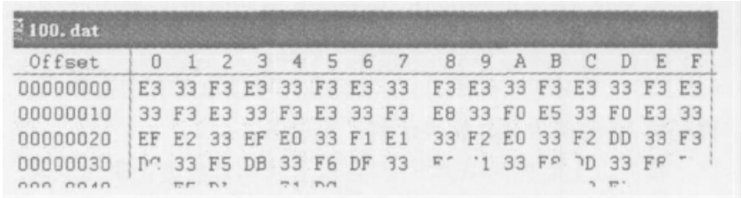
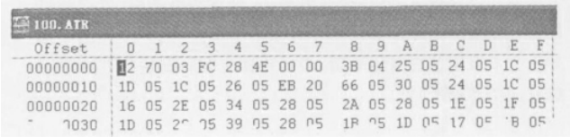
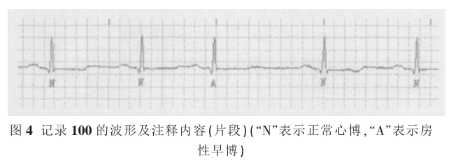
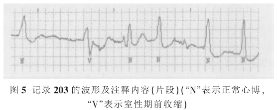
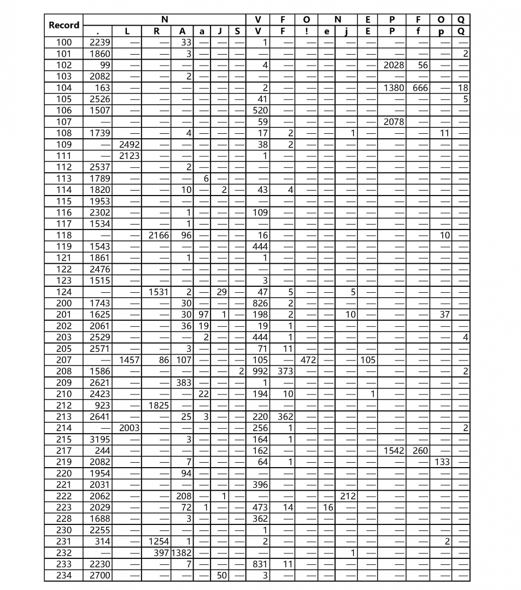

**小组作业是坏文明**  
1、MIT-BIH Arrhythmia Database  
https://www.physionet.org/content/mitdb/1.0.0/  
任务1：A、编写代码，显示ECG波形；B、完成R波标定算法（提示采用小波技术），给出框图；C、完成20例以  
上不同样本（人均5例）的R波标注并统计和专家标注的误差。  
任务2： A、编写代码，显示ECG波形；B、完成P波标注，给出框图；C、完成12例不同样本P波（人均2例）的P  
波标注并统计和专家标注的误差。https://www.physionet.org/content/pwave/1.0.0/  
任务3：A、编写代码，显示12导联ECG波形；B、给出基于小波变换心电降噪方案，展示针对不同信噪比条件下的  
降噪效果；https://www.physionet.org/content/nstdb/1.0.0/

MIT-BIH为了节省文件长度和存储空间，使用了自定义的格式。一个心电记录由三个部分组成：  
（1）头文件\[.hea\]，存储方式ASCII码字符,记录文件名、导联数、采样率、数据点数  
（2）数据文件\[.dat\]，按二进制，采用212格式进行存储，每三个字节存储两个数，一个数12bit。  
（3）注释文件\[.atr\]，按二进制存储，记录了心电专家对相应的心电信号的诊断信息。

各导联类型  
在大多数记录中，  
第一条信号是MLII型（通过将电极置于胸部而获得），  
第二条信号通常是V1（偶尔是V2或V5，在一个实例中是V4）  
现将各记录中导联类型统计如下：  

```
MLII、V1 : 101、105、106、107、108、109、111、112、113、115、116、118、119、121、122、200、201、202、214、215、217、219、220、221、222、223、228、230、231、232、233、234
MLII、V2 ： 103、117
MLII、V4 ： 124
MLII、V5 ： 100、123
V5、MLII ： 114
V5、V2 ：102、104
```

第一行为记录行，指出该记录为一包含两个采样率为360Hz的信号，每一信号的长度为65万个采样点，采样开始时间和日期没有记录。后面紧跟的两行为信号技术规范说明行，从中可以看出，两个信号都包含在文件格式100.dat中，每一信号都是以12位的位压缩格式（**即“212”格式**）进行存储的，两个信号的增益都是每200ADCuints/mV，ADC的分辨率为11位，ADC零值为1024，在这里基线值没有明确给出，但可以认为他等于ADC零值1024。两个信号的第一采样点的值分别为995和1011（可以看出这他们都略低于0V），65万个采样点的校验数分别为-22131和20052，输入输出可以以任何尺寸的块来执行，因为文件内容说明了这两个信号的该值都为0，**信号描述字段说明了这两个信号分别采自MLII导联和V5导联**。文件的最后两行包含了注释字符串，其中第一行说明了患者的性别和年龄以及记录数据，第二行列出了患者的用药情况。（MIT—BIH心率失常数据库的识读及应用，宋喜国，中国医学物理学杂志，2004年7月第21卷第4期）

“212”格式是针对两个信号的数据库记录，**这两个信号的数据交替存储，每三个字节存储两个数据**。假设这两个数据分别采样自**信号0和信号1**，  
**信号0的采样数据取自第一、二字节**(16位)的高12位，**其中第一字节作为低8位，第二字节的高4位作为其高4位**；  
**信号1的采样数据由第二字节的低4位**（作为组成信号1采样数据的12位的高4位）**和下一字节的8位**（作为组成信号1采样数据的12位的低8位）共同组成。以100.dat为例。  



按照“212”的格式，从第一字节读起，每三个字节（24 位）表示两个值，第一组为“E333 F3”,两个值则分别为 0x3E3和 0x3F3转换为十进制分别为 **995和 1011**，代表的信号幅度分别为 **4.975mv和 5.055mv**，这两个值分别是两个信号的第一采样点，后面依此类推，分别表示了两个信号的采样值。

“.atr”为注释文件，  
记录了心电专家对相应的心电信号的诊断信息，主要有两种格式：MIT格式和AHA格式。**MIT格式是一种紧凑型格式，每一注释的长度占用偶数个字节空间，多数情况下是占用两个字节，多用于在线的注释文件**；而AHA格式的每一注释占用16个字节的空间，多用于交换文件的情况。  
**这两种格式的在文件中的区分决定于前两个字节的值**，若文件的**第一字节不为0或第二字节等于“\[”(0x5B)或“\]”(0x5D)，则该文件是以MIT格式存储的**，否则是按AHA格式存储的。  
**心律失常数据库采用的MIT格式**。

MIT格式，**每一注释单元的前两个字节的第一个字节为最低有效位**，**16位中的最高6位表示了注释类型代码**（具体代码见后表），**剩余的10位说明了该注释点的发生时间或辅助信息**，若为发生时间，其值为该注释点到前一注释点的间隔（对于第一个注释点为从记录开始到该点的间隔），若为辅助信息则说明了附加信息的长度。以100.atr为例。



从文件中的第一字节不为0可以判断该文件是以MIT格式存储的。从第一字节开始按照MIT格式进行分析，  
**首先读出16位值0x7012**，**其高6位的值为0x1C(十进制28)**，，**该类型代码为28**，**代表意义是节律变化**，**发生时间在0.05秒（18/360Hz）**；  
**接着读出后面的16位值0xFC03**，**其高6为的值为0x3F（十进制63）**，**低10位的值为0x03**，**该类型代码为63**，**代表的意义是在该16位值后附加了3个**（**低10位值代表的数）字节的辅助信息，若字节个数为奇数，则再附加一个字节的空值**，在本例中就是“284E0000”；  
然后再从下一字节读16位值0x043B，**其高6位的值为1，低10位的值为0x3B（十进制59）**，该类型码**1代表正常心搏**，发生时间为**0.213秒（（18+59）/360Hz）**；  
依次类推即可读出所有的注释，当**读到的16位值为0时，就表示到了文件尾**。

另，当高6位为十进制59时，**读取之后第3个16位的高6位，作为类型代码**，读取之后**第二个16位+第一个16位\*2^16**；  
高6位为十进制60，61，62时，继续读下一个16位

按照以上所述的识读方法!在这里我们对数据记录100和203进行读取，并显示其波形和注释信息. 图4显示了记录100的波形片段及其注释信息!图中的第三个QRS波注释代码为A表示该心博为房性早博  
图5显示了记录203的波形片段及其注释信息!其中第二个QRS波注释代码为V表示该心博为室性期前收缩  





  

**搏动类型数量统计表**  
搏动类型表的列标题第一行是AHA注释代码（ N、V、F、E、P、Q 和 O ）；第二行为MIT注释代码，有关符号的详细说明参见下边的**注释标记说明**  
表中统计了每条记录中每种类型的节拍数

注：在数据库的[可视化波形](https://www.physionet.org/lightwave/?db=mitdb/1.0.0)中，得到了  
1.注释P在波形中标记为 ‘/’；2.注释p在任一可视化波形中无标记；3.可视化波形中有未统计标记 ‘x’



**注释标记说明**  
注释是指向记录中的特定位置并描述这些位置上的事件的标签。下面表格包含心跳注释和非心跳注释（[信息来源](https://www.physionet.org/physiobank/database/html/mitdbdir/tables.htm)）

| 注释代码 | Symbol | Meaning | 中文含义 |
| --- | --- | --- | --- |
| 0 |  | No TQRS |  |
| 1 | **· or N** | **Normal beat** | **正常搏动** |
| 2 | L | Left bundle branch block beat | 左束支传导阻滞 |
| 3 | R | Right bundle branch block beat | 右束支传导阻滞 |
| 4 | a | Aberrated atrial premature beat | 异常房性早搏 |
| 5 | **V** | **Premature ventricular contraction** | **室性早搏** |
| 6 | F | Fusion of ventricular and normal beat | 心室融合心跳 |
| 7 | J | Nodal (junctional) premature beat | 交界性早搏 |
| 8 | **A** | **Atrial premature beat** | **房性早搏** |
| 9 | S | Premature or ectopic supraventricular beat | 室上性早搏或异位性搏动 |
| 10 | E | Ventricular escape beat | 室性逸搏 |
| 11 | j | Nodal (junctional) escape beat | 交界性逸搏 |
| 12 | / | Paced beat | 起博心跳 |
| 13 | Q | Unclassifiable beat | 未分类心跳 |
| 14 | ~ | signal quality change |  |
| 16 | I | isolated QRS-like artifact |  |
| 18 | s | ST change |  |
| 19 | T | T-wave change |  |
| 20 | \* | systole |  |
| 21 | D | diastole |  |
| 22 | " | comment annotation |  |
| 23 | \= | measurement annotation |  |
| 24 | p | P-wave peak |  |
| 25 | B | left or right bundle branch block |  |
| 26 | ^ | non-conducted pacer spike |  |
| 27 | t | T-wave peak |  |
| 28 | + | **rhythm change** | 心率节奏变化 |
| 29 | u | U-wave peak |  |
| 30 | ? | learning |  |
| 31 | ! | ventricular flutter wave |  |
| 32 | \[ | start of ventricular flutter/fibrillation |  |
| 33 | \] | end of ventricular flutter/fibrillation |  |
| 34 | e | atrial escape beat | 房性逸搏 |
| 35 | n | supraventricular escape beat | 室上性逸搏 |
| 36 |  | link to external data (aux contains URL) |  |
| 37 | x | non-conducted P-wave (blocked APB) |  |
| 38 | f | fusion of paced and normal beat |  |
| 39 | ( | waveform onset |  |
| 40 | ) | waveform end |  |
| 41 | r | R-on-T premature ventricular contraction |
