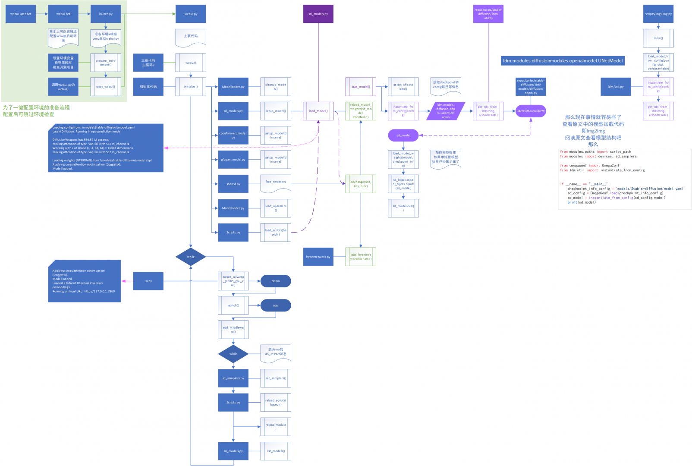

由于不是目前我着急的研究方向，不像之前的模型那样细说惹，是轻量云服务器，剩的内存不多，给自己留条活路，先甩一下之前webui的项目地址和磁链地址

* * *

[git项目地址](https://github.com/AUTOMATIC1111/stable-diffusion-webui)

[novelai权重地址](https://huggingface.co/datasets/AluminiumOxide/personal_latent_diffusion/tree/main)

[法术书(已经变成老版本了)](http://aluminium/allophane.com/resource/NovelAI法术书.xlsx)

* * *

哦~[这迷人的cuda安装广告~](https://www.bilibili.com/video/BV1qh411Y7uX/)

基本上正常克隆git项目后，将novelai的权重(选一个目录下的model.ckpt和config.yaml)挪到 项目目录\\models\\Stable-diffusion\\目录下，就可以了

也可以不改，设置 cmd\_opts的(ArgumentParser的) 参数，省去换文件路径  
\--ckpt 为 checkpoint路径  
\--config 为 yaml路径  
  
也可以改（我不太建议）script\_path (默认设置的是调用该脚本目录下的models目录) 和 sd\_model\_file (默认script\_path+model.ckpt)

配置后直接运行webui-user.bat，就会自动配置venv环境，并像下面这个流程图一样调用到webui.py，再根据命令行提示打开网页

如果是环境配置好的话，是可以直接在命令行启动venv环境，调webui.py启动项目的

权重磁链(如果huggingface没法进) magnet:?xt=urn:btih:LPPEILNIMJS3M4FD4XVDCY5PVUWG7DWM
