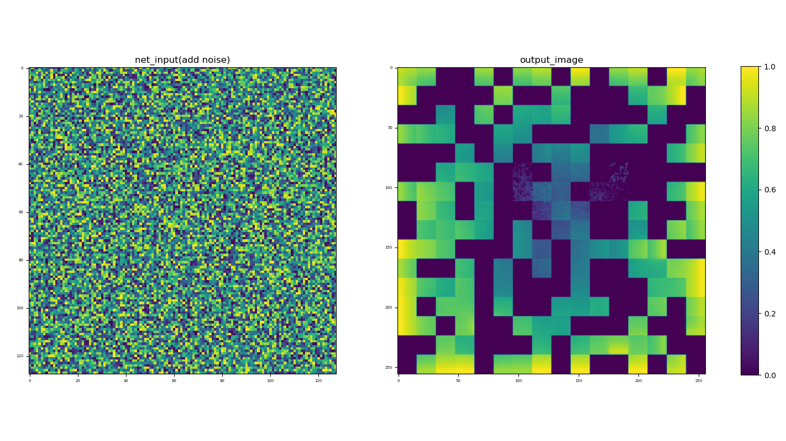

啊是的没错，之前为了看数据方便些，训练时难免会遇到存tensorboardX的习惯，但是直接往里面add\_image的图片是不带colorbar的，这看起来很难受啊，所以就更倾向于直接让matplotlib先画图

原本是这样的思路，直接plt.figure()后一顿操作，最后plt.save('float\_image.png'),然后再重新用PIL和numpy打开

```
plt.figure()
"""drawing..."""
plt.save('float_image.png')
plt.close()

"""reopen image file,which waste too much time"""
np_img = np.array(Image.open('float_image.png'))[:, :, 0:3]

writer = SummaryWriter()
writer.add_image('figure image', np_img,1, dataformats='HWC')
writer.close()
```

```
from tensorboardX import SummaryWriter
from PIL import Image
import matplotlib.pyplot as plt
import numpy as np
```

这种方法可行，但是，，，浪费时间，是真的频繁调用文件操作浪费时间，而且有时候还会出现这种极度美艳的场景，虽然我也不知道是为什么但是这种事情就很...美妙



然后就是考虑直接读不行吗？于是就找到了tensorboard的文档[在 TensorBoard 中显示图像数据  |  TensorFlow (google.cn)](https://tensorflow.google.cn/tensorboard/image_summaries?hl=zh-CN)  
这个文档里是直接读的，但是读的时候用的是tf.image.decode\_png就很难受，能不能有一个避开使用tensorflow的方法啊  
numpy还真的可以，直接用np.asarray()

现在就相当于是把figure对象保留到内存里，然后直接让PIL处理内存中的图像，省去文件读写能让速度快不少

```
figure = plt.figure()
"""drawing... and save the plot to a image in memory. """

buf = io.BytesIO()

plt.savefig(buf, format='png')
plt.close(figure)

"""Convert image buffer to numpy """
buf.seek(0)  # change pointer to the begin of image buffer
np_img = np.asarray(Image.open(buf))[:, :, 0:3]

writer = SummaryWriter()
writer.add_image('figure image', np_img ,1 , dataformats='HWC')
writer.close()
```

```
from tensorboardX import SummaryWriter
from PIL import Image
import matplotlib.pyplot as plt
import numpy as np
import io
```

当然，这是个没什么用的冷知识

看网友也有写的比较简洁的这里也引用一下

```
from PIL import Image
from io import BytesIO

img = np.ones((256,256,3), dtype=np.uint8)
plt.figure()
plt.imshow(img, cmap='gray')
buffer = BytesIO()
plt.savefig(buffer, format='png')
new_img = np.asarray(Image.open(buffer)) # new_img就是figure的数组
plt.close()
buffer.close()
```

[link1](https://blog.csdn.net/baoxin1100/article/details/112917517)、[link2](https://blog.csdn.net/zywvvd/article/details/109538750)、[link3](https://blog.csdn.net/weixin_43002433/article/details/107109776)、、、、
