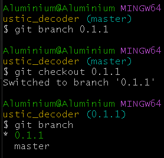

- 创建分支

 git branch <new branch name>

- 切换分支

 git checkout <new branch name>

- 同时 创建并切换 分支

 git checkout -b <new branch name>

- 直接查看branch

 git branch

- 分支更新(第一步如果以前拉过可以忽略)

 git remote add <alias> https://github.com/AluminiumOxide/<repository>.git  
 git pull <alias> <branch name>

local name 相当于是那个git在本地的别名 可以用 `git remote` 查看

- 分支上传(我记得之前有记,那直接略了，基本就是add添加到暂存区+commit添加到本地仓库+push本地版本库推送到远程服务器

 git add .  
 git commit -m '<new describe>'   
 git push <alias> <branch name> 

或者直接创建新的分支推送

 git push <alias> <new branch name> 

##### 其他

- 删除本地分支, 补充：git branch -D 可以强制删除

 git branch -d <branch name> 

- 删除远程分支

 git push <alias> --delete <remote branch name>

- git clone 指定分支

 git clone -b <branch name>  https://github.com/AluminiumOxide/<repository>.git

- 打开分支查看

 gitk
